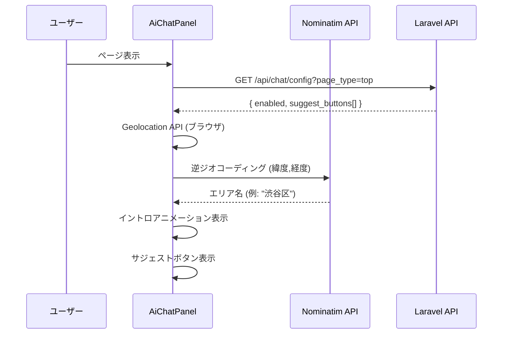
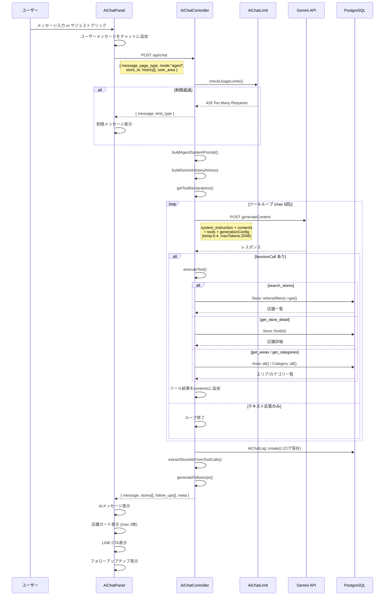
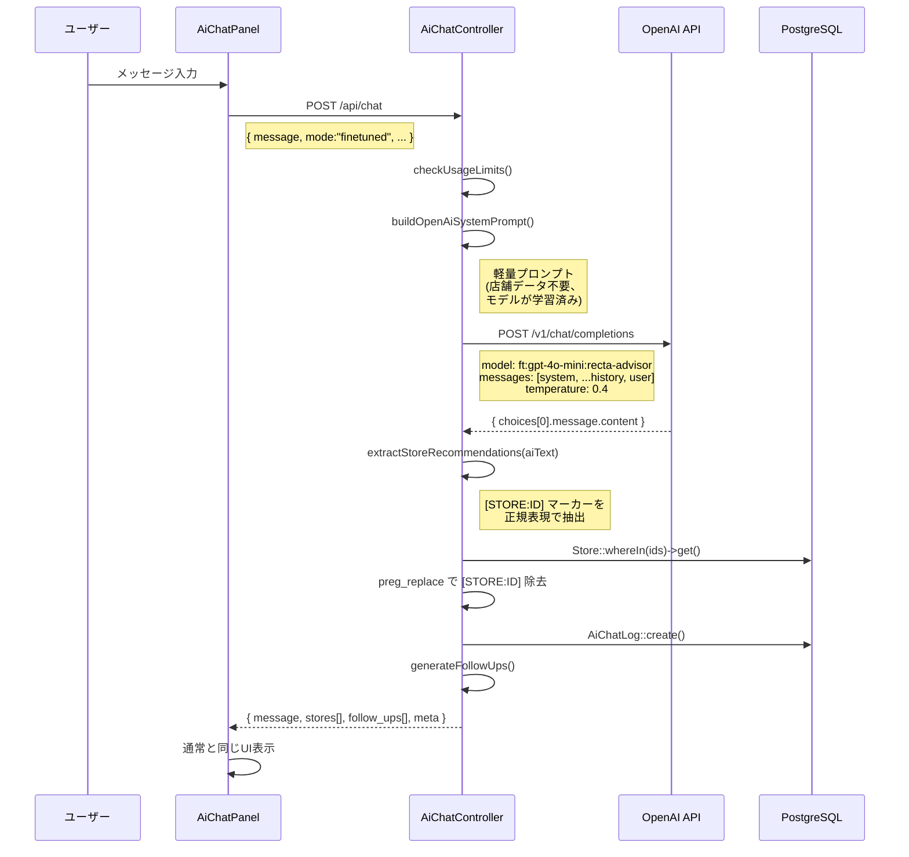
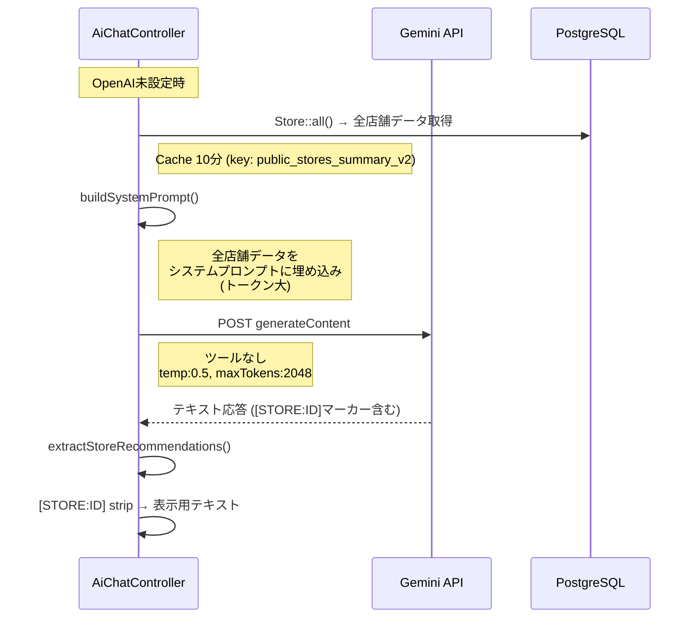

# AIチャット アーキテクチャ

## システム概要

```
ブラウザ (AiChatPanel)
    │
    ├─ GET  /api/chat/config     → 設定・サジェストボタン取得
    └─ POST /api/chat            → チャットメッセージ送信
           │
           ▼
    AiChatController::chat()
           │
           ├─ 利用制限チェック (checkUsageLimits)
           │
           ├─→ Agent mode ──→ Gemini API (Function Calling)
           │                      │
           │                      └─ ツールループ (max 5回)
           │                           ├─ search_stores → PostgreSQL
           │                           ├─ get_store_detail → PostgreSQL
           │                           ├─ get_areas → PostgreSQL
           │                           └─ get_categories → PostgreSQL
           │
           └─→ Finetuned mode
                  │
                  ├─ OpenAI設定あり → OpenAI API (ft:gpt-4o-mini)
                  └─ OpenAI設定なし → Gemini API (プロンプト埋め込み)
```

---

## シーケンス図

### 1. 初期化フロー



### 2. Agent mode (メインフロー)



### 3. Finetuned mode (OpenAI)



### 4. Finetuned mode フォールバック (Gemini)



---

## 利用制限

```
┌─────────────────┬───────────┬───────────────────────┐
│ 制限タイプ       │ デフォルト │ 対象                   │
├─────────────────┼───────────┼───────────────────────┤
│ global_daily    │ 10,000/日  │ 全ユーザー合計          │
│ user_daily      │ 50/日      │ 認証済みユーザー        │
│ user_monthly    │ 500/月     │ 認証済みユーザー        │
│ ip_daily        │ 10/日      │ 未認証ユーザー (IP単位)  │
└─────────────────┴───────────┴───────────────────────┘
```

---

## ツール定義 (Agent mode)

| ツール名 | 説明 | 主要パラメータ |
|---------|------|--------------|
| `search_stores` | 条件検索 | area, category, min_hourly, max_hourly, tags[], nearest_station, same_day_trial, has_guarantee, keyword, sort, limit |
| `get_store_detail` | 店舗詳細 | store_id |
| `get_areas` | エリア一覧 | なし |
| `get_categories` | カテゴリ一覧 | なし |

---

## フォローアップ生成ロジック

```
入力: userMessage + aiResponse + pageType
    │
    ├─ detail ページ → 固定サジェスト
    │   └─ [体入の流れ, バック・保証の詳細, 実際の雰囲気]
    │
    └─ その他 → 文脈分析
        ├─ 既出トピック検出: area, salary, beginner, trial, norma, guarantee
        ├─ 未出トピックからサジェスト生成
        └─ フォールバック: [未経験OKのお店, 高時給のお店, 体入できるお店]

出力: max 3件の提案テキスト
```

---

## APIレスポンス形式

```json
{
  "message": "AIの回答テキスト",
  "stores": [
    {
      "id": 1,
      "name": "Club Lumière",
      "area": "六本木",
      "nearest_station": "六本木駅",
      "hourly_min": 4000,
      "hourly_max": 8000,
      "description": "...",
      "images": [{"url": "...", "order": 1}]
    }
  ],
  "follow_ups": ["体入できるお店", "ノルマなしのお店"],
  "meta": {
    "mode": "agent",
    "model": "gemini-3.1-flash-lite-preview",
    "input_tokens": 1234,
    "output_tokens": 567,
    "total_tokens": 1801,
    "response_ms": 2340,
    "tool_calls": 2
  }
}
```

---

## ファイル構成

| ファイル | 役割 |
|---------|------|
| `frontend/app/components/user/AiChatPanel.tsx` | チャットUI全体 |
| `frontend/app/lib/api.ts` | API通信クライアント |
| `frontend/app/lib/line.ts` | LINE友だち追加URL管理 |
| `backend/app/Http/Controllers/AiChatController.php` | チャットAPI (全ロジック) |
| `backend/app/Models/AiChatLog.php` | チャットログ |
| `backend/app/Models/AiChatSetting.php` | ページ別設定 |
| `backend/app/Models/AiChatLimit.php` | 利用制限 |
| `backend/app/Console/Commands/GenerateFineTuningData.php` | 訓練データ生成 |
| `backend/config/services.php` | API設定 (gemini, openai) |

---

## モード比較

| | Agent mode | Finetuned mode (OpenAI) | Finetuned mode (Gemini fallback) |
|---|---|---|---|
| **API** | Gemini 3.1 Flash-Lite | OpenAI gpt-4o-mini (ft) | Gemini 3.1 Flash-Lite |
| **ツール** | Function Calling (4ツール) | なし | なし |
| **店舗データ** | ツール経由でDB検索 | モデルが学習済み | システムプロンプトに全件埋め込み |
| **店舗抽出** | ツール結果から直接 | [STORE:ID]マーカーで抽出 | [STORE:ID]マーカーで抽出 |
| **Temperature** | 0.4 | 0.4 | 0.5 |
| **トークン消費** | 中 (ツール結果分) | 小 (プロンプト軽量) | 大 (全店舗埋め込み) |
| **レイテンシ** | 中〜高 (ツールループ) | 低 | 中 |
| **精度** | 高 (リアルタイムDB検索) | 中 (学習時のデータ) | 中 (プロンプト内データ) |
