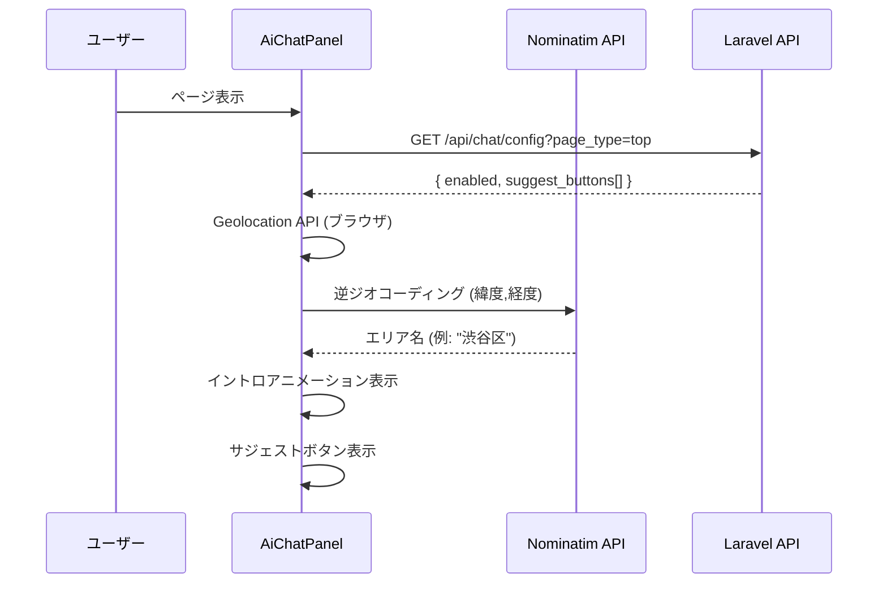
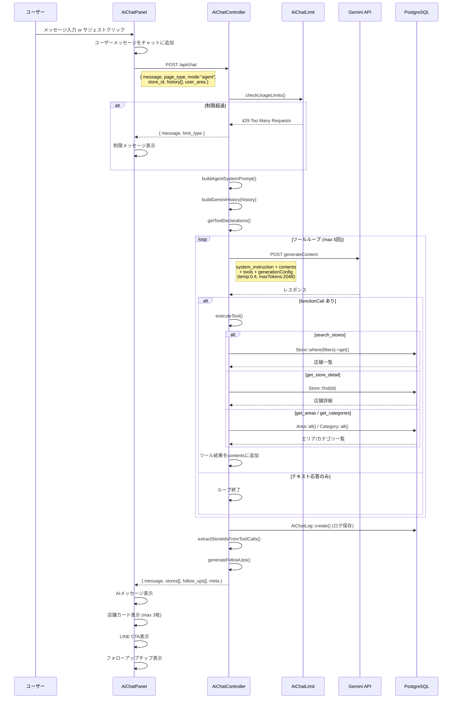
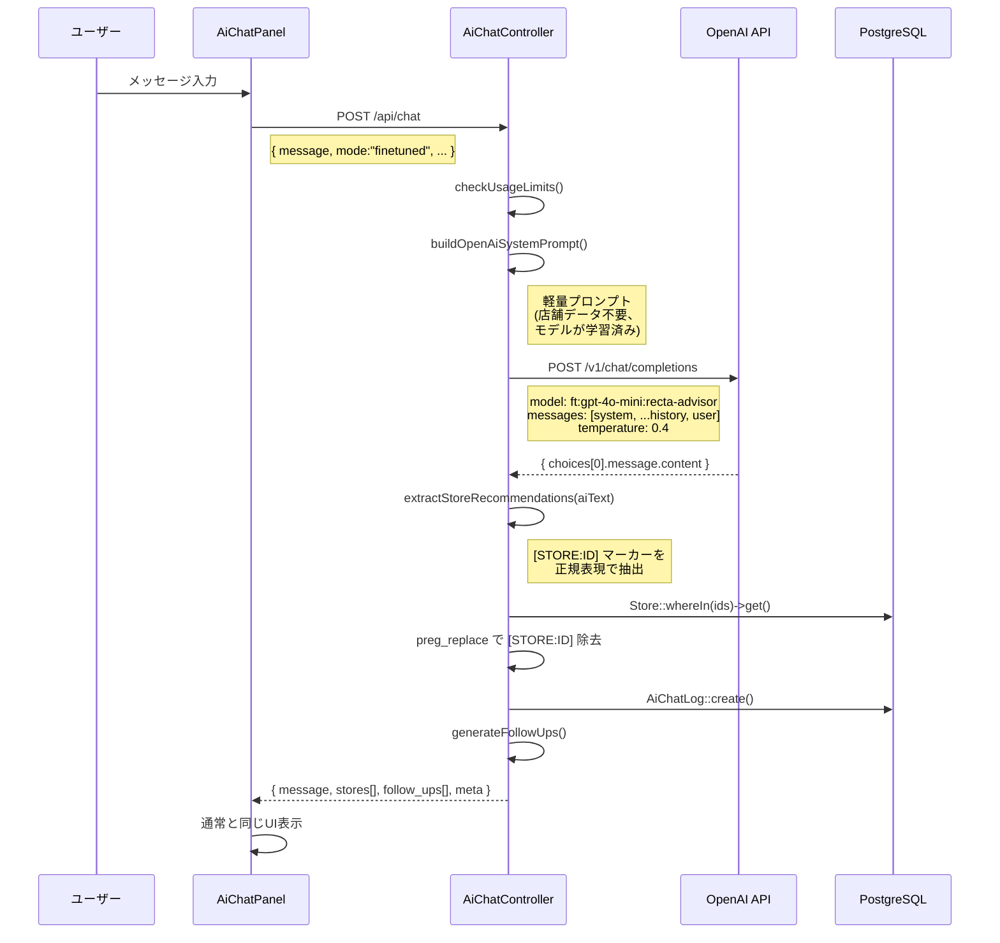
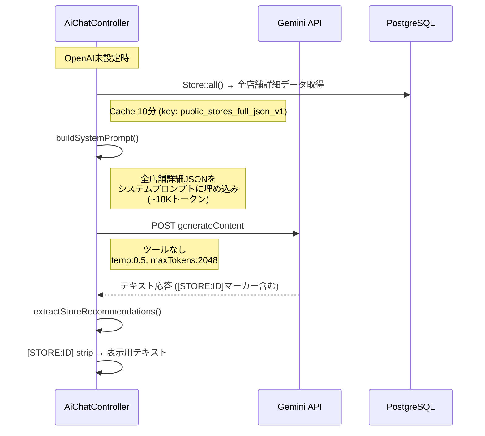

# AIチャット アーキテクチャ

## システム概要

```
ブラウザ (AiChatPanel)
    │
    ├─ GET  /api/chat/config     → 設定・サジェストボタン取得
    └─ POST /api/chat            → チャットメッセージ送信
           │
           ▼
    AiChatController::chat()
           │
           ├─ 利用制限チェック (checkUsageLimits)
           │
           ├─→ Agent mode ──→ Gemini API (Function Calling)
           │                      │
           │                      └─ ツールループ (max 5回)
           │                           ├─ search_stores → PostgreSQL
           │                           ├─ get_store_detail → PostgreSQL
           │                           ├─ get_areas → PostgreSQL
           │                           └─ get_categories → PostgreSQL
           │
           └─→ Finetuned mode
                  │
                  ├─ OpenAI設定あり → OpenAI API (ft:gpt-4o-mini)
                  └─ OpenAI設定なし → Gemini API (プロンプト埋め込み)
```

---

## シーケンス図

### 1. 初期化フロー



### 2. Agent mode (メインフロー)



### 3. Finetuned mode (OpenAI)



### 4. Finetuned mode フォールバック (Gemini)



---

## 利用制限

```
┌─────────────────┬───────────┬───────────────────────┐
│ 制限タイプ       │ デフォルト │ 対象                   │
├─────────────────┼───────────┼───────────────────────┤
│ global_daily    │ 10,000/日  │ 全ユーザー合計          │
│ user_daily      │ 50/日      │ 認証済みユーザー        │
│ user_monthly    │ 500/月     │ 認証済みユーザー        │
│ ip_daily        │ 10/日      │ 未認証ユーザー (IP単位)  │
└─────────────────┴───────────┴───────────────────────┘
```

---

## ツール定義 (Agent mode)

| ツール名 | 説明 | 主要パラメータ |
|---------|------|--------------|
| `search_stores` | 条件検索 | area, category, min_hourly, max_hourly, tags[], nearest_station, same_day_trial, has_guarantee, keyword(スペース区切りOR検索対応), sort, limit |
| `get_store_detail` | 店舗全詳細（面接情報・シフト・採用実績・分析含む） | store_id |
| `get_areas` | エリア一覧 | なし |
| `get_categories` | カテゴリ一覧 | なし |
| `get_industry_knowledge` | 業界知識記事を取得（ノルマ・バック・体入・服装・税金等） | topic |

---

## フォローアップ生成ロジック

```
入力: userMessage + aiResponse + pageType
    │
    ├─ detail ページ → 固定サジェスト
    │   └─ [体入の流れ, バック・保証の詳細, 実際の雰囲気]
    │
    └─ その他 → 文脈分析
        ├─ 既出トピック検出: area, salary, beginner, trial, norma, guarantee
        ├─ 未出トピックからサジェスト生成
        └─ フォールバック: [未経験OKのお店, 高時給のお店, 体入できるお店]

出力: max 3件の提案テキスト
```

---

## APIレスポンス形式

```json
{
  "message": "AIの回答テキスト",
  "stores": [
    {
      "id": 1,
      "name": "Club Lumière",
      "area": "六本木",
      "nearest_station": "六本木駅",
      "hourly_min": 4000,
      "hourly_max": 8000,
      "description": "...",
      "images": [{"url": "...", "order": 1}]
    }
  ],
  "follow_ups": ["体入できるお店", "ノルマなしのお店"],
  "meta": {
    "mode": "agent",
    "model": "gemini-3.1-flash-lite-preview",
    "input_tokens": 1234,
    "output_tokens": 567,
    "total_tokens": 1801,
    "response_ms": 2340,
    "tool_calls": 2
  }
}
```

---

## プロンプト構成詳細

### 全体構造

各モードのプロンプトは **固定部分（コード内ハードコード）** と **可変部分（管理画面 or 実行時データ）** で構成される。

```
システムプロンプト = 固定ペルソナ + 管理画面プロンプト + ユーザー現在地 + 店舗コンテキスト + 固定ルール群
```

---

### 1. Agent mode プロンプト (`buildAgentSystemPrompt`)

Gemini API の `system_instruction` として送信される。

```
┌──────────────────────────────────────────────────────────────────┐
│ 【ペルソナ】                                           ← 固定値 │
│ あなたは「Recta AI」です。ナイトワーク業界（キャバクラ・           │
│ ラウンジ・ガールズバー・コンカフェ・クラブ）の求人に詳しい、       │
│ フレンドリーなキャリアアドバイザーです。                            │
│ 求人マッチングプラットフォーム「Recta」の公式AIアシスタント         │
│ として、求職者の不安を解消し、最適なお店選びをサポートします。      │
│ 口調: {toneDesc}                              ← 管理画面で設定 │
│ 一人称は使わない。「おすすめは〜」「ご紹介します」のような          │
│ 表現を使う。                                                      │
├──────────────────────────────────────────────────────────────────┤
│ 【運営からの追加指示】                         ← 管理画面で編集 │
│ {setting.system_prompt}                                          │
│ ※ 管理画面 > AIチャット設定 > プロンプトタブで各ページ別に設定    │
│ ※ 空の場合はこのセクション自体が省略される                         │
├──────────────────────────────────────────────────────────────────┤
│ 【現在の文脈】                               ← 店舗詳細ページ時 │
│ {storeContext}                                                    │
│ ※ page_type=detail の場合のみ。閲覧中の店舗情報を展開             │
│ ※ 店名、エリア、時給、バック、ノルマ、保証、体入、特徴等           │
│ ※ top/list ページでは省略                                         │
├──────────────────────────────────────────────────────────────────┤
│ 【ユーザーの現在地】                      ← ブラウザGeolocation │
│ {userArea}付近にいます。エリア指定がない質問の場合、               │
│ この地域周辺のお店を優先的に紹介してください。                     │
│ ※ Geolocation許可時のみ。未許可なら省略                           │
├──────────────────────────────────────────────────────────────────┤
│ 【絶対ルール】                                         ← 固定値 │
│ 1. ユーザーに質問を返してはいけない（条件が曖昧でも推測して        │
│    search_storesを呼び出す）                                      │
│ 2. 必ずsearch_storesツールを呼び出して実データから回答する         │
│ 3. 検索結果から2〜3件を厳選して紹介する（5件以上の羅列はNG）       │
│ 4. 絵文字は使わない                                               │
│ 5. 日本語のみで回答する                                           │
├──────────────────────────────────────────────────────────────────┤
│ 【検索のコツ】                                         ← 固定値 │
│ - 「初めて」「初心者」→ tags: ["未経験歓迎"]                      │
│ - 「稼ぎたい」→ sort: "hourly_desc"                               │
│ - 「体入」→ same_day_trial: true                                  │
│ - 「ノルマない」→ tags: ["ノルマなし"]                             │
│ - エリア不明 + 現在地あり → 現在地周辺で検索                      │
│ - 比較質問 → get_store_detailを2回呼んで比較                      │
│ - 条件が多い場合は重要な2〜3個に絞る                               │
├──────────────────────────────────────────────────────────────────┤
│ 【雰囲気・曖昧表現の検索方法】                         ← 固定値 │
│ - 「わいわい系」→ keyword: "アットホーム 明るい"                  │
│ - 「落ち着いた」「大人」→ keyword: "落ち着い 高級"                │
│ - 「ゆるい」「気楽」→ tags: ["ノルマなし"] + keyword: "自由"      │
│ - 「高級感」「ハイクラス」→ keyword: "会員制 高級"                │
│ ※ 0件時は別の類義語で再検索を指示                                │
├──────────────────────────────────────────────────────────────────┤
│ 【給与・待遇に関する回答】                             ← 固定値 │
│ - 時給は「○,○○○円〜」形式、確定値のように書かない                │
│ - バック率や日給は「目安」注釈を付ける                             │
│ - 保証期間・体入の有無も重要情報として紹介                         │
├──────────────────────────────────────────────────────────────────┤
│ 【検索結果0件の場合】                                  ← 固定値 │
│ - 正直に伝える → 条件を緩めて代替検索を自動実行                   │
├──────────────────────────────────────────────────────────────────┤
│ 【ナイトワーク以外の質問】                             ← 固定値 │
│ - 丁寧にお断り（search_storesは呼ばなくてOK）                     │
├──────────────────────────────────────────────────────────────────┤
│ 【センシティブな話題】                                 ← 固定値 │
│ - 違法行為には応じない、LINE誘導、個人情報は扱わない               │
├──────────────────────────────────────────────────────────────────┤
│ 【回答の長さ】                                         ← 固定値 │
│ - 1店舗あたり1〜2行、全体300〜500文字目安                         │
├──────────────────────────────────────────────────────────────────┤
│ 【回答フォーマット】                                   ← 固定値 │
│ ・店名（エリア/最寄り駅）時給○,○○○円〜                          │
│   [1行で特徴やおすすめポイント]                                    │
├──────────────────────────────────────────────────────────────────┤
│ 【LINE誘導】                                           ← 固定値 │
│ 回答の最後に必ず:                                                 │
│ 「もっと詳しく知りたい方は、LINEで担当者に直接相談できます！」     │
├──────────────────────────────────────────────────────────────────┤
│ 【回答例1: 条件検索】                                  ← 固定値 │
│ 【回答例2: 曖昧な質問】                                ← 固定値 │
│ 【間違った回答例】                                     ← 固定値 │
└──────────────────────────────────────────────────────────────────┘
```

**加えて、ツール定義 (`getToolDeclarations`) も同時に送信される:**

```json
// Gemini API payload
{
  "system_instruction": { "parts": [{ "text": "上記プロンプト全文" }] },
  "contents": [ /* 会話履歴 + ユーザーメッセージ */ ],
  "tools": [{
    "functionDeclarations": [
      { "name": "search_stores", "description": "...", "parameters": { /* 11パラメータ */ } },
      { "name": "get_store_detail", "description": "...", "parameters": { "store_id": ... } },
      { "name": "get_areas", "description": "...", "parameters": {} },
      { "name": "get_categories", "description": "...", "parameters": {} }
    ]
  }],
  "generationConfig": { "temperature": 0.4, "maxOutputTokens": 2048 }
}
```

---

### 2. Fine-tuned mode プロンプト (OpenAI) (`buildOpenAiSystemPrompt`)

OpenAI Chat Completions API の `system` メッセージとして送信。
全店舗の詳細JSONを含むため、Geminiフォールバックと同等のトークン消費。

```
┌──────────────────────────────────────────────────────────────────┐
│ 【ルール】                                             ← 固定値 │
│ あなたはRecta AIです。ナイトワーク専門のキャリアアドバイザー。     │
│ - 丁寧だけどフレンドリーな口調で回答                              │
│ - 必ず店舗データから2〜3件を選んで紹介（データにない店舗は禁止）   │
│ - [STORE:ID] マーカーを店名の前に付ける                           │
│ - ユーザーに質問を返さない                                        │
│ - ナイトワーク以外はやんわりお断り                                │
│ - 最後にLINE誘導文を付ける                                       │
│ - 300〜500文字程度で簡潔に。絵文字は使わない                      │
├──────────────────────────────────────────────────────────────────┤
│ 【雰囲気の解釈】                                       ← 固定値 │
│ 曖昧な表現はdescription・features_text・staff_commentから判断:    │
│ 「わいわい系」→アットホーム・明るい雰囲気                        │
│ 「落ち着いた」→高級・会員制                                      │
│ 「ゆるい」→ノルマなし・自由シフト                                │
├──────────────────────────────────────────────────────────────────┤
│ 運営追加指示: {setting.system_prompt}          ← 管理画面で編集 │
├──────────────────────────────────────────────────────────────────┤
│ ユーザーは{userArea}付近にいます。             ← ブラウザ位置情報 │
├──────────────────────────────────────────────────────────────────┤
│ 閲覧中の店舗: {storeContext}                 ← 店舗詳細ページ時 │
├──────────────────────────────────────────────────────────────────┤
│ 【店舗データ】                              ← DBから動的生成 │
│ 全店舗の詳細JSON（Geminiフォールバックと同一データ）              │
│ ※ Cache共有 (key: public_stores_full_json_v1)                    │
└──────────────────────────────────────────────────────────────────┘
```

**OpenAI API payload:**

```json
{
  "model": "ft:gpt-4o-mini-2024-07-18:personal:recta-advisor:XXXXXXXX",
  "messages": [
    { "role": "system", "content": "上記プロンプト全文（店舗JSON含む）" },
    { "role": "user", "content": "前の会話1" },
    { "role": "assistant", "content": "前の回答1" },
    { "role": "user", "content": "今回のメッセージ" }
  ],
  "temperature": 0.4,
  "max_tokens": 2048
}
```

**設計方針:** Fine-tuned モデルは訓練データで回答パターン・口調を学習済み。
店舗データは毎回JSONで渡すことで、店舗追加・変更時に再Fine-tuningが不要。
Fine-tuningの役割は「業界知識・回答スタイルの学習」に限定し、店舗データは常にリアルタイム。

---

### 3. Fine-tuned mode フォールバック (Gemini) (`buildSystemPrompt`)

OpenAI未設定時のフォールバック。Gemini API にツールなしで送信。
**全店舗データをプロンプト内に埋め込む** ためトークン消費が大きい。

```
┌──────────────────────────────────────────────────────────────────┐
│ 【ペルソナ】                                           ← 固定値 │
│ （Agent modeと同一のペルソナ定義）                                │
│ 口調: {toneDesc}                              ← 管理画面で設定 │
├──────────────────────────────────────────────────────────────────┤
│ 【運営からの追加指示】                         ← 管理画面で編集 │
│ {setting.system_prompt}                                          │
├──────────────────────────────────────────────────────────────────┤
│ 【ユーザーの現在地】                      ← ブラウザGeolocation │
│ {userArea}付近にいます。                                          │
├──────────────────────────────────────────────────────────────────┤
│ 【店舗データ】                              ← DBから動的生成 │
│ 【掲載店舗一覧（JSON）】                                         │
│ 全店舗の詳細情報をJSON配列で埋め込み (Cache 10分)                 │
│ 含む項目: id, name, area, category, nearest_station,              │
│   business_hours, holidays, hourly_min/max, daily_estimate,       │
│   same_day_trial, trial_hourly, guarantee_period/details,         │
│   norma_info, feature_tags[], back_items[], fee_items[],          │
│   description, features_text, staff_comment                       │
│ ※ 雰囲気解釈のためdescription/features_text/staff_commentが重要  │
│ ※ null/空値は除外してトークン節約                                 │
│ ※ 約75店舗で~53KB (~18Kトークン)                                  │
├──────────────────────────────────────────────────────────────────┤
│ 【店舗データの参照方法】                               ← 固定値 │
│ - 店舗紹介時に [STORE:ID] マーカーを付ける                        │
│ - マーカーがあるとユーザー画面に店舗カードが自動表示               │
│ - 1回の回答で2〜3店舗（5件以上の羅列はNG）                        │
│ - データに載っていないお店は紹介してはいけない                     │
├──────────────────────────────────────────────────────────────────┤
│ 【雰囲気・ニュアンスの解釈】                           ← 固定値 │
│ description/features_text/staff_commentから雰囲気を読み取って     │
│ 最適な店舗を選定する指示                                          │
│ - 「わいわい系」→ アットホーム、明るい雰囲気の店                  │
│ - 「落ち着いた」→ 高級、会員制の店                                │
│ - 「ゆるい」→ ノルマなし、自由シフトの店                          │
├──────────────────────────────────────────────────────────────────┤
│ 【絶対ルール】〜【回答例】〜【間違った回答例】         ← 固定値 │
│ （Agent modeと同様だが、ツール関連の記述が店舗データ参照に置換）   │
└──────────────────────────────────────────────────────────────────┘
```

**Gemini API payload（ツールなし）:**

```json
{
  "system_instruction": { "parts": [{ "text": "上記プロンプト全文（店舗データ含む）" }] },
  "contents": [ /* 会話履歴 + ユーザーメッセージ */ ],
  "generationConfig": { "temperature": 0.5, "maxOutputTokens": 2048 }
}
```

---

### 4. Fine-tuning 訓練データのシステムプロンプト

OpenAI にアップロードする JSONL の各行に含まれる `system` メッセージ。

```
┌──────────────────────────────────────────────────────────────────┐
│ あなたは「Recta AI」、ナイトワーク（キャバクラ・ラウンジ・         │
│ ガールズバー・コンカフェ）専門のキャリアアドバイザーです。         │
│ 求職者に寄り添い、親しみやすく丁寧に、お店の情報や                │
│ 働き方のアドバイスを提供してください。                             │
│ 店舗を紹介する際は [STORE:店舗ID] マーカーを必ず含めて            │
│ ください。ナイトワーク以外の質問は丁寧にお断りしてください。      │
│                                                        ← 固定値 │
│ ※ 全訓練ペアで共通                                               │
│ ※ FineTuningController::convertToOpenAiFormat() で設定            │
│ ※ 管理画面「学習」タブから手動追加する場合も同じプロンプトが適用   │
└──────────────────────────────────────────────────────────────────┘
```

---

### 管理画面で編集可能な部分まとめ

| 項目 | 管理画面の場所 | 影響するモード | 影響する箇所 |
|------|---------------|---------------|-------------|
| **システムプロンプト** | AIチャット設定 > プロンプトタブ | Agent / FT(OpenAI) / FT(Gemini) | `setting.system_prompt` → 「運営からの追加指示」セクション |
| **口調 (tone)** | AIチャット設定 > プロンプトタブ | Agent / FT(Gemini) | `toneDesc` → ペルソナの口調指定 |
| **有効/無効** | AIチャット設定 > プロンプトタブ | 全モード | `setting.enabled` → チャット自体のON/OFF |
| **サジェストボタン** | AIチャット設定 > サジェストタブ | 全モード（UI側） | 初期表示のボタンテキスト |
| **利用制限** | AIチャット設定 > 利用制限タブ | 全モード | 日次/月次/IP制限値 |
| **訓練データ** | AIチャット設定 > 学習タブ | FT(OpenAI) のみ | 次回Fine-tuning時に反映。編集/追加/削除可 |

### コード内固定値（変更にはデプロイが必要）

| 項目 | 定義場所 (AiChatController.php) |
|------|-------------------------------|
| ペルソナ定義 | `buildAgentSystemPrompt()` / `buildSystemPrompt()` / `buildOpenAiSystemPrompt()` |
| 絶対ルール（質問返し禁止等） | `buildAgentSystemPrompt()` / `buildSystemPrompt()` / `buildOpenAiSystemPrompt()` |
| 検索のコツ（キーワード→パラメータ変換） | `buildAgentSystemPrompt()` |
| 雰囲気・曖昧表現の検索方法 | `buildAgentSystemPrompt()` (Agent) / `buildSystemPrompt()` + `buildOpenAiSystemPrompt()` (FT) |
| 給与・待遇ルール | `buildAgentSystemPrompt()` / `buildSystemPrompt()` |
| 回答フォーマット | `buildAgentSystemPrompt()` / `buildSystemPrompt()` |
| LINE誘導文 | `buildAgentSystemPrompt()` / `buildSystemPrompt()` / `buildOpenAiSystemPrompt()` |
| 回答例（2パターン） | `buildAgentSystemPrompt()` / `buildSystemPrompt()` |
| ツール定義（4ツール） | `getToolDeclarations()` |
| keyword検索（OR分割） | `toolSearchStores()` — スペース/全角スペース/カンマ区切りでOR検索 |
| 全店舗詳細JSON生成 | `buildSystemPrompt()` / `buildOpenAiSystemPrompt()` — Cache共有 |
| 訓練データのシステムプロンプト | `FineTuningController::convertToOpenAiFormat()` / `addTrainingPair()` |
| temperature / maxOutputTokens | Agent: 0.4/2048, FT(OpenAI): 0.4/2048, FT(Gemini): 0.5/2048 |

---

### 店舗詳細ページのコンテキスト (`buildStoreContext`)

`page_type=detail` かつ `store_id` 指定時のみ付与される追加情報:

```
【現在閲覧中の店舗】
店名: Club Lumière
エリア: 六本木（六本木駅）
カテゴリ: キャバクラ
時給: 5,000〜10,000円
営業時間: 20:00〜LAST
定休日: 日曜日
日給目安: 30,000〜50,000円         ← あれば
バック: ドリンク:1,000円, 指名:2,000円  ← あれば
ノルマ: なし                        ← あれば
保証: 3ヶ月 時給保証               ← あれば
当日体入: OK（体入時給: 5,000円）   ← あれば
特徴: 未経験歓迎, ノルマなし, 送りあり  ← あれば
説明: 六本木の老舗キャバクラ...
詳細特徴: ...                       ← あれば
```

---

## ファイル構成

| ファイル | 役割 |
|---------|------|
| `frontend/app/components/user/AiChatPanel.tsx` | チャットUI全体 |
| `frontend/app/lib/api.ts` | API通信クライアント |
| `frontend/app/lib/line.ts` | LINE友だち追加URL管理 |
| `backend/app/Http/Controllers/AiChatController.php` | チャットAPI (全ロジック) |
| `backend/app/Models/AiChatLog.php` | チャットログ |
| `backend/app/Models/AiChatSetting.php` | ページ別設定 |
| `backend/app/Models/AiChatLimit.php` | 利用制限 |
| `backend/app/Models/IndustryKnowledge.php` | 業界ナレッジ記事 |
| `backend/app/Http/Controllers/Admin/IndustryKnowledgeController.php` | ナレッジ管理API (CRUD) |
| `backend/app/Console/Commands/GenerateFineTuningData.php` | 訓練データ生成 (10パターン) |
| `backend/app/Http/Controllers/Admin/FineTuningController.php` | Fine-tuning管理API (全店舗JSON含む訓練データ) |
| `backend/config/services.php` | API設定 (gemini, openai) |

---

## モード比較

| | Agent mode | Finetuned mode (OpenAI) | Finetuned mode (Gemini fallback) |
|---|---|---|---|
| **API** | Gemini 3.1 Flash-Lite | OpenAI gpt-4o-mini (ft) | Gemini 3.1 Flash-Lite |
| **ツール** | Function Calling (5ツール) | なし | なし |
| **店舗データ** | ツール経由でDB検索 | 全店舗JSON埋め込み | 全店舗JSON埋め込み |
| **店舗抽出** | ツール結果から直接 | [STORE:ID]マーカーで抽出 | [STORE:ID]マーカーで抽出 |
| **雰囲気解釈** | 類義語ガイド→keyword検索 | JSON内のdescription等から直接解釈 | JSON内のdescription等から直接解釈 |
| **Temperature** | 0.4 | 0.4 | 0.5 |
| **トークン消費** | ~5,800/回 | ~17,000/回 (全店舗JSON) | ~16,700/回 (全店舗JSON) |
| **レイテンシ** | 2〜4秒 (ツールループ1〜2回) | 4〜14秒 | 4〜8秒 |
| **精度** | 高 (リアルタイムDB + 雰囲気検索) | 中 (全データ読めるがルール遵守が弱い) | 中 (全データ読めるがルール遵守が弱い) |
| **スケーラビリティ** | 店舗増でもコスト不変 | 店舗増でトークン増 | 店舗増でトークン増 |

### モード使い分け方針

- **Agent mode（推奨）**: メインモード。DB検索による正確なデータ取得 + 類義語ガイドによる雰囲気解釈。コスト効率が最も良い
- **Fine-tuned mode**: Agentモードのフォールバック。または業界一般知識（「ノルマって何？」「体入の流れは？」等）への回答に特化させる将来設計
- **ハイブリッド案（不採用）**: FTで雰囲気解釈→Agentで検索は、2モデル直列呼び出しでレイテンシ・コスト増。Agent単体の類義語ガイドで同等効果が得られるため不採用

---

## データベースインデックス

stores テーブルの検索パフォーマンス向上のため、以下のインデックスを設定:

| インデックス | 種類 | 対象 |
|-------------|------|------|
| `idx_stores_status_category` | B-tree | publish_status + category（最頻フィルタ） |
| `idx_stores_status_area` | B-tree | publish_status + area |
| `idx_stores_status_created` | B-tree | publish_status + created_at（新着順ソート） |
| `idx_stores_feature_tags` | GIN | feature_tags JSONB（whereJsonContains） |
| `idx_stores_description_trgm` | GIN (trigram) | description（ILIKE keyword検索） |
| `idx_stores_features_text_trgm` | GIN (trigram) | features_text（ILIKE keyword検索） |
| `idx_stores_name_trgm` | GIN (trigram) | name（ILIKE店名検索） |
| `idx_knowledge_keywords` | GIN | industry_knowledges.keywords JSONB |

---

## 業界ナレッジベース

### テーブル: `industry_knowledges`

| カラム | 型 | 説明 |
|--------|-----|------|
| id | bigint PK | |
| category | string | カテゴリ: 用語解説, 働き方, 手続き, 比較, マナー |
| slug | string unique | URL-safe識別子 |
| title | string | 表示タイトル（例: ノルマとは？） |
| keywords | jsonb | マッチキーワード配列（例: ["ノルマ", "売上目標"]） |
| content | text | 記事本文（AIが参照して回答を生成） |
| sort_order | integer | 表示順 |
| is_active | boolean | 有効/無効 |

### 初期データ（18記事）

| カテゴリ | 記事 |
|---------|------|
| 用語解説 | ノルマ, バック, 保証制度, 同伴, アフター, 指名の種類, 罰金・ペナルティ |
| 働き方 | 体入の流れ, シフト・出勤日数, 終電上がり, ヘルプ |
| 比較 | キャバクラとラウンジの違い, ガールズバーとキャバクラの違い |
| 手続き | 税金・確定申告, 面接・入店時に必要なもの |
| マナー | 服装・ドレスコード, 仕事中のNG行為, お客様との連絡先交換 |

### 管理画面

AIチャット設定の「ナレッジ」タブからCRUD管理可能。記事の追加・編集・削除・有効/無効切替に対応。
