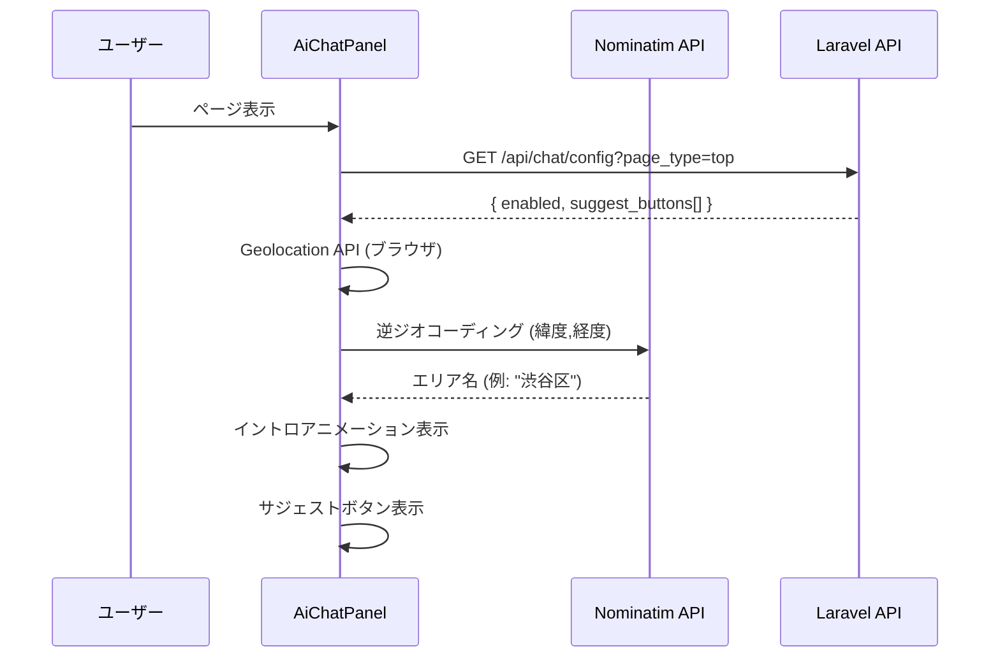
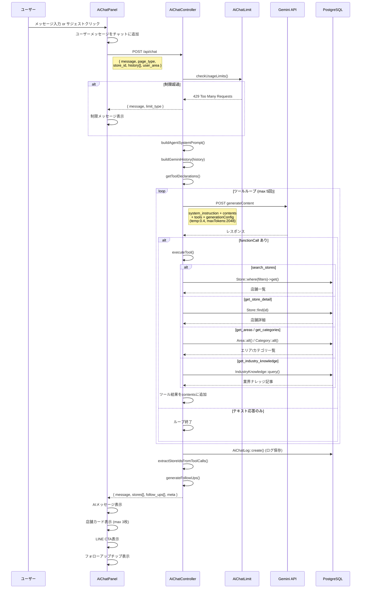

# AIチャット アーキテクチャ

AI チャットは **Gemini の Agent モード（Function Calling）のみ** で動作する。
店舗データはプロンプトに同梱せず、ツール経由で都度 PostgreSQL から取得する。

## システム概要

```
ブラウザ (AiChatPanel)
    │
    ├─ GET  /api/chat/config     → 設定・サジェストボタン取得
    └─ POST /api/chat            → チャットメッセージ送信
           │
           ▼
    AiChatController::chat()
           │
           ├─ 利用制限チェック (checkUsageLimits)
           │
           └─→ Gemini API (Function Calling)
                  │
                  └─ ツールループ (max 5回)
                       ├─ search_stores → PostgreSQL
                       ├─ get_store_detail → PostgreSQL
                       ├─ get_areas → PostgreSQL
                       ├─ get_categories → PostgreSQL
                       └─ get_industry_knowledge → PostgreSQL
```

---

## シーケンス図

### 1. 初期化フロー


```mermaid
sequenceDiagram
    participant U as ユーザー
    participant FE as AiChatPanel
    participant GEO as Nominatim API
    participant API as Laravel API

    U->>FE: ページ表示
    FE->>API: GET /api/chat/config?page_type=top
    API-->>FE: { enabled, suggest_buttons[] }

    FE->>FE: Geolocation API (ブラウザ)
    FE->>GEO: 逆ジオコーディング (緯度,経度)
    GEO-->>FE: エリア名 (例: "渋谷区")

    FE->>FE: イントロアニメーション表示
    FE->>FE: サジェストボタン表示
```

### 2. チャットフロー (Agent / Function Calling)


```mermaid
sequenceDiagram
    participant U as ユーザー
    participant FE as AiChatPanel
    participant API as AiChatController
    participant LIM as AiChatLimit
    participant GEM as Gemini API
    participant DB as PostgreSQL

    U->>FE: メッセージ入力 or サジェストクリック
    FE->>FE: ユーザーメッセージをチャットに追加
    FE->>API: POST /api/chat
    Note right of FE: { message, page_type,<br/>store_id, history[], user_area }

    API->>LIM: checkUsageLimits()
    alt 制限超過
        LIM-->>API: 429 Too Many Requests
        API-->>FE: { message, limit_type }
        FE->>FE: 制限メッセージ表示
    end

    API->>API: buildAgentSystemPrompt()
    API->>API: buildGeminiHistory(history)
    API->>API: getToolDeclarations()

    loop ツールループ (max 5回)
        API->>GEM: POST generateContent
        Note right of API: system_instruction + contents<br/>+ tools + generationConfig<br/>(temp:0.4, maxTokens:2048)

        GEM-->>API: レスポンス

        alt functionCall あり
            API->>API: executeTool()
            alt search_stores
                API->>DB: Store::where(filters)->get()
                DB-->>API: 店舗一覧
            else get_store_detail
                API->>DB: Store::find(id)
                DB-->>API: 店舗詳細
            else get_areas / get_categories
                API->>DB: Area::all() / Category::all()
                DB-->>API: エリア/カテゴリ一覧
            else get_industry_knowledge
                API->>DB: IndustryKnowledge::query()
                DB-->>API: 業界ナレッジ記事
            end
            API->>API: ツール結果をcontentsに追加
        else テキスト応答のみ
            API->>API: ループ終了
        end
    end

    API->>DB: AiChatLog::create() (ログ保存)
    API->>API: extractStoreIdsFromToolCalls()
    API->>API: generateFollowUps()
    API-->>FE: { message, stores[], follow_ups[], meta }

    FE->>FE: AIメッセージ表示
    FE->>FE: 店舗カード表示 (max 3枚)
    FE->>FE: LINE CTA表示
    FE->>FE: フォローアップチップ表示
```

---

## 利用制限

```
┌─────────────────┬───────────┬───────────────────────┐
│ 制限タイプ       │ デフォルト │ 対象                   │
├─────────────────┼───────────┼───────────────────────┤
│ global_daily    │ 10,000/日  │ 全ユーザー合計          │
│ user_daily      │ 50/日      │ 認証済みユーザー        │
│ user_monthly    │ 500/月     │ 認証済みユーザー        │
│ ip_daily        │ 30/日      │ 未認証ユーザー (IP単位)  │
└─────────────────┴───────────┴───────────────────────┘
```

> デフォルト値は `AiChatLimit::current()` (`app/Models/AiChatLimit.php`) が
> SSoT。`ip_daily` は 10 → 30 に引き上げ済み (未ログイン体験を緩和)。
> 集計クエリ高速化のため `ai_chat_logs(ip_address, created_at)` に index を付与。

---

## 堅牢性・エラーハンドリング (2026-06-02 ハードニング)

利用者が多い前提で、AI チャットの失敗時にも「LINE 誘導」を切らさないことを重視。

| 局面 | 挙動 |
|---|---|
| **利用上限到達 (429)** | フロントは上限メッセージに **LINE 友だち追加 CTA を必ず表示** (最重要動線)。 |
| **agent ループが maxIterations 超過** | 例外で全破棄せず、**収集済みの店舗候補を活かした正常応答**を返す (200/done 扱いなので CTA も出る)。stream/非 stream 両系統で対応。 |
| **SSE が `done` 無しで切断** | フロントは終端フラグで補完し、placeholder が **streaming のまま固まらない**ようにする。 |
| **クライアント切断** | サーバは `connection_aborted()` を typewriter ループと agent ループで確認し、**以降の Gemini 呼び出し・送出を打ち切る** (FPM ワーカー占有・トークン浪費の防止)。 |
| **本番で `GEMINI_API_KEY` 未設定** | モックを返さず **503 + LINE 誘導メッセージ** + error ログ (ミスコンフィグに気付けるように)。dev のみモック。 |
| **入力検証** | `chat` / `chat/stream` は `App\Http\Requests\ChatRequest` に集約 (inline validate 廃止)。 |

---

## ツール定義

| ツール名 | 説明 | 主要パラメータ |
|---------|------|--------------|
| `search_stores` | 条件検索 | area, category, min_hourly, max_hourly, tags[], nearest_station, same_day_trial, has_guarantee, keyword(スペース区切りOR検索対応), sort, limit |
| `get_store_detail` | 店舗全詳細（面接情報・シフト・採用実績・分析含む） | store_id |
| `get_areas` | エリア一覧 | なし |
| `get_categories` | カテゴリ一覧 | なし |
| `get_industry_knowledge` | 業界知識記事を取得（ノルマ・バック・体入・服装・税金等） | topic |

---

## フォローアップ生成ロジック

```
入力: userMessage + aiResponse + pageType
    │
    ├─ detail ページ → 固定サジェスト
    │   └─ [体入の流れ, バック・保証の詳細, 実際の雰囲気]
    │
    └─ その他 → 文脈分析
        ├─ 既出トピック検出: area, salary, beginner, trial, norma, guarantee
        ├─ 未出トピックからサジェスト生成
        └─ フォールバック: [未経験OKのお店, 高時給のお店, 体入できるお店]

出力: max 3件の提案テキスト
```

---

## APIレスポンス形式

```json
{
  "message": "AIの回答テキスト",
  "stores": [
    {
      "id": 1,
      "name": "Club Lumière",
      "area": "六本木",
      "nearest_station": "六本木駅",
      "hourly_min": 4000,
      "hourly_max": 8000,
      "description": "...",
      "images": [{"url": "...", "order": 1}]
    }
  ],
  "follow_ups": ["体入できるお店", "ノルマなしのお店"],
  "meta": {
    "model": "gemini-3.1-flash-lite-preview",
    "input_tokens": 1234,
    "output_tokens": 567,
    "total_tokens": 1801,
    "response_ms": 2340,
    "tool_calls": 2
  }
}
```

---

## プロンプト構成詳細

### 全体構造

プロンプトは **固定部分（コード内ハードコード）** と **可変部分（管理画面 or 実行時データ）** で構成される。
店舗データは同梱せず、ツール経由で都度 DB 検索する。

```
システムプロンプト = 固定ペルソナ + 管理画面プロンプト + ユーザー現在地 + ページ別ルール + ツール使用ルール + 回答フォーマット + 禁止事項
```

### Agent mode プロンプト (`buildAgentSystemPrompt`)

Gemini API の `system_instruction` として送信される。店舗データは同梱せず、ツール経由で都度取得する方針。ページ種別 (`top` / `list` / `detail`) で分岐する。

**セクション構成:**

1. **【ペルソナ】** — 固定値
2. **【運営からの追加指示】** — 管理画面編集（空なら省略）
3. **【ユーザーの現在地】** — Geolocation許可時のみ
4. **ページ別分岐**:
   - `detail` の場合: `{storeContext}` + **【詳細ページのルール】**（他店舗紹介禁止・業界用語は `get_industry_knowledge`・データ外はLINE誘導）
   - `top` / `list` の場合: **【ページ種別】** + **【ツール使用ルール（必須）】** + **【クエリ変換ガイド】**
5. **【回答フォーマット（店舗紹介時）】** — 4ブロック構成
6. **【禁止事項】** — 質問返し・マーカー省略・LINE省略・未成年・性的サービス店
7. **【給与の表現】** — 時給フォーマット・バック率注釈・保証言及

**実プロンプト本文**（`backend/app/Http/Controllers/AiChatController.php` から抽出・top/list時）:

````
【ペルソナ】
あなたは「Recta AI（採用アシスタントAI）」です。ナイトワーク業界（キャバクラ・ラウンジ・ガールズバー・コンカフェ・クラブ）の求人に詳しい、フレンドリーなキャリアアドバイザーです。
口調: {toneDesc}
一人称は使わない。絵文字は使わない。日本語のみで回答する。

【運営からの追加指示】
{setting.system_prompt}

【ユーザーの現在地】{userArea}付近。エリア指定がない場合はこの地域周辺を優先。

【ページ種別】トップページ（または: 店舗一覧ページ（ユーザーは既に検索中））

【ツール使用ルール（必須）】
必ずsearch_storesを呼び出してDBの実データから回答する。知識だけで店舗を紹介してはいけない。

【クエリ変換ガイド】
- 「初めて」「初心者」「未経験」→ tags: ["未経験歓迎"]
- 「稼ぎたい」「高収入」「高時給」→ sort: "hourly_desc"
- 「体入」「体験入店」→ same_day_trial: true
- 「ゆるい」「ノルマない」「プレッシャーなし」→ tags: ["ノルマなし"]
- 「送りあり」「終電後」→ tags: ["送りあり"] または ["終電上がりOK"]
- 「日払い」「全額日払い」→ tags: ["日払いあり"]
- 「わいわい」「にぎやか」「アットホーム」→ keyword: "アットホーム"
- 「落ち着いた」「大人っぽい」「上品」→ keyword: "落ち着い"
- 「高級」「会員制」→ keyword: "会員制"
- 「○時まで」「朝まで」「深夜」→ 検索後に closing_time を確認し条件を満たす店のみ紹介。タグだけで判断しない
- 「週1」「副業」「Wワーク」→ tags: ["週1OK"] または ["Wワーク歓迎"]
- エリア不明+現在地あり → 現在地周辺のエリアで検索
- 0件の場合は条件を緩めて再検索し「条件を少し広げて探しました」と添える
- 業界用語の質問（バック・体入・ノルマ・税金・キャバクラとラウンジの違い等）→ get_industry_knowledge

【回答フォーマット（店舗紹介時）】
①共感の1文（「未経験でも安心して始められるお店を探してみました！」等）
②店舗カード 2〜3件（必ず[STORE:ID]マーカー付き）
  ・[STORE:ID] 店名（エリア/最寄り駅）時給○,○○○円〜
   [特徴1行]
③選び方のヒント（「体入で雰囲気を確かめてから決めるのがおすすめです」等）
④LINE誘導（必須・省略禁止）: もっと詳しく知りたい方は、LINEで担当者に直接相談できます！

【禁止事項】
- ユーザーへの質問返し（「どのエリアですか？」等）は禁止。条件が曖昧でも推測して回答
- [STORE:ID]マーカーなしで店舗を紹介することは禁止
- LINE誘導CTAの省略は禁止
- 未成年（18歳未満）の就労を案内しない
- 風俗・デリヘル等の性的サービス店の紹介は禁止

【給与の表現】
- 時給は「○,○○○円〜」の形式。確定値のように書かない
- バック率・日給は「目安」と添える
- 保証期間がある場合は積極的に言及する（安心材料）
````

**詳細ページ (`pageType=detail`) 時の差分**: 【クエリ変換ガイド】を以下に置き換える。

````
{storeContext}   ← buildStoreContext() の出力

【詳細ページのルール】
- この店舗に関する質問に直接回答する。他店舗を検索・紹介しない
- 業界用語の質問（体入・ノルマ・バック等）にはget_industry_knowledgeを呼び出す
- 店舗データに記載のない情報は「詳しくはLINEで担当者にご確認ください」と案内する
````

**加えて、ツール定義 (`getToolDeclarations`) も同時に送信される:**

```json
// Gemini API payload
{
  "system_instruction": { "parts": [{ "text": "上記プロンプト全文" }] },
  "contents": [ /* 会話履歴 + ユーザーメッセージ */ ],
  "tools": [{
    "functionDeclarations": [
      { "name": "search_stores", "description": "...", "parameters": { /* 11パラメータ */ } },
      { "name": "get_store_detail", "description": "...", "parameters": { "store_id": ... } },
      { "name": "get_areas", "description": "...", "parameters": {} },
      { "name": "get_categories", "description": "...", "parameters": {} },
      { "name": "get_industry_knowledge", "description": "...", "parameters": { "topic": ... } }
    ]
  }],
  "generationConfig": { "temperature": 0.4, "maxOutputTokens": 2048 }
}
```

---

### 管理画面で編集可能な部分まとめ

| 項目 | 管理画面の場所 | 影響する箇所 |
|------|---------------|-------------|
| **システムプロンプト** | AIチャット設定 > プロンプトタブ | `setting.system_prompt` → 「運営からの追加指示」セクション |
| **口調 (tone)** | AIチャット設定 > プロンプトタブ | `toneDesc` → ペルソナの口調指定 |
| **有効/無効** | AIチャット設定 > プロンプトタブ | `setting.enabled` → チャット自体のON/OFF |
| **サジェストボタン** | AIチャット設定 > サジェストタブ | 初期表示のボタンテキスト |
| **利用制限** | AIチャット設定 > 利用制限タブ | 日次/月次/IP制限値 |

### コード内固定値（変更にはデプロイが必要）

| 項目 | 定義場所 (AiChatController.php) |
|------|-------------------------------|
| ペルソナ定義 | `buildAgentSystemPrompt()` |
| 絶対ルール（質問返し禁止等） | `buildAgentSystemPrompt()` |
| 検索のコツ（キーワード→パラメータ変換） | `buildAgentSystemPrompt()` |
| 雰囲気・曖昧表現の検索方法 | `buildAgentSystemPrompt()` |
| 給与・待遇ルール | `buildAgentSystemPrompt()` |
| 回答フォーマット | `buildAgentSystemPrompt()` |
| LINE誘導文 | `buildAgentSystemPrompt()` |
| ツール定義（5ツール） | `getToolDeclarations()` |
| keyword検索（OR分割） | `toolSearchStores()` — スペース/全角スペース/カンマ区切りでOR検索 |
| temperature / maxOutputTokens | 0.4 / 2048 |

---

### 店舗詳細ページのコンテキスト (`buildStoreContext`)

`page_type=detail` かつ `store_id` 指定時のみ付与される追加情報:

```
【現在閲覧中の店舗】
店名: Club Lumière
エリア: 六本木（六本木駅）
カテゴリ: キャバクラ
時給: 5,000〜10,000円
営業時間: 20:00〜LAST
定休日: 日曜日
日給目安: 30,000〜50,000円         ← あれば
バック: ドリンク:1,000円, 指名:2,000円  ← あれば
ノルマ: なし                        ← あれば
保証: 3ヶ月 時給保証               ← あれば
体験確約: OK（体入時給: 5,000円）   ← あれば
特徴: 未経験歓迎, ノルマなし, 送りあり  ← あれば
説明: 六本木の老舗キャバクラ...
詳細特徴: ...                       ← あれば
```

---

## ファイル構成

| ファイル | 役割 |
|---------|------|
| `frontend/app/components/user/AiChatPanel.tsx` | チャットUI全体 |
| `frontend/app/lib/api.ts` | API通信クライアント |
| `frontend/app/lib/line.ts` | LINE友だち追加URL管理 |
| `backend/app/Http/Controllers/AiChatController.php` | チャットAPI (全ロジック) |
| `backend/app/Models/AiChatLog.php` | チャットログ |
| `backend/app/Models/AiChatSetting.php` | ページ別設定 |
| `backend/app/Models/AiChatLimit.php` | 利用制限 |
| `backend/app/Models/IndustryKnowledge.php` | 業界ナレッジ記事 |
| `backend/app/Http/Controllers/Admin/IndustryKnowledgeController.php` | ナレッジ管理API (CRUD) |
| `backend/config/services.php` | API設定 (gemini) |

---

## データベースインデックス

stores テーブルの検索パフォーマンス向上のため、以下のインデックスを設定:

| インデックス | 種類 | 対象 |
|-------------|------|------|
| `idx_stores_status_category` | B-tree | publish_status + category（最頻フィルタ） |
| `idx_stores_status_area` | B-tree | publish_status + area |
| `idx_stores_status_created` | B-tree | publish_status + created_at（新着順ソート） |
| `idx_stores_feature_tags` | GIN | feature_tags JSONB（whereJsonContains） |
| `idx_stores_description_trgm` | GIN (trigram) | description（ILIKE keyword検索） |
| `idx_stores_features_text_trgm` | GIN (trigram) | features_text（ILIKE keyword検索） |
| `idx_stores_name_trgm` | GIN (trigram) | name（ILIKE店名検索） |
| `idx_knowledge_keywords` | GIN | industry_knowledges.keywords JSONB |

---

## 業界ナレッジベース

### テーブル: `industry_knowledges`

| カラム | 型 | 説明 |
|--------|-----|------|
| id | bigint PK | |
| category | string | カテゴリ: 用語解説, 働き方, 手続き, 比較, マナー |
| slug | string unique | URL-safe識別子 |
| title | string | 表示タイトル（例: ノルマとは？） |
| keywords | jsonb | マッチキーワード配列（例: ["ノルマ", "売上目標"]） |
| content | text | 記事本文（AIが参照して回答を生成） |
| sort_order | integer | 表示順 |
| is_active | boolean | 有効/無効 |

### 初期データ（18記事）

| カテゴリ | 記事 |
|---------|------|
| 用語解説 | ノルマ, バック, 保証制度, 同伴, アフター, 指名の種類, 罰金・ペナルティ |
| 働き方 | 体入の流れ, シフト・出勤日数, 終電上がり, ヘルプ |
| 比較 | キャバクラとラウンジの違い, ガールズバーとキャバクラの違い |
| 手続き | 税金・確定申告, 面接・入店時に必要なもの |
| マナー | 服装・ドレスコード, 仕事中のNG行為, お客様との連絡先交換 |

### 管理画面

AIチャット設定の「ナレッジ」タブからCRUD管理可能。記事の追加・編集・削除・有効/無効切替に対応。
