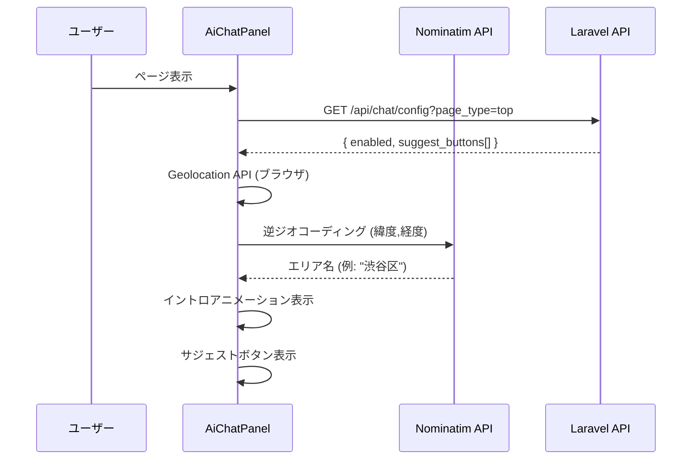
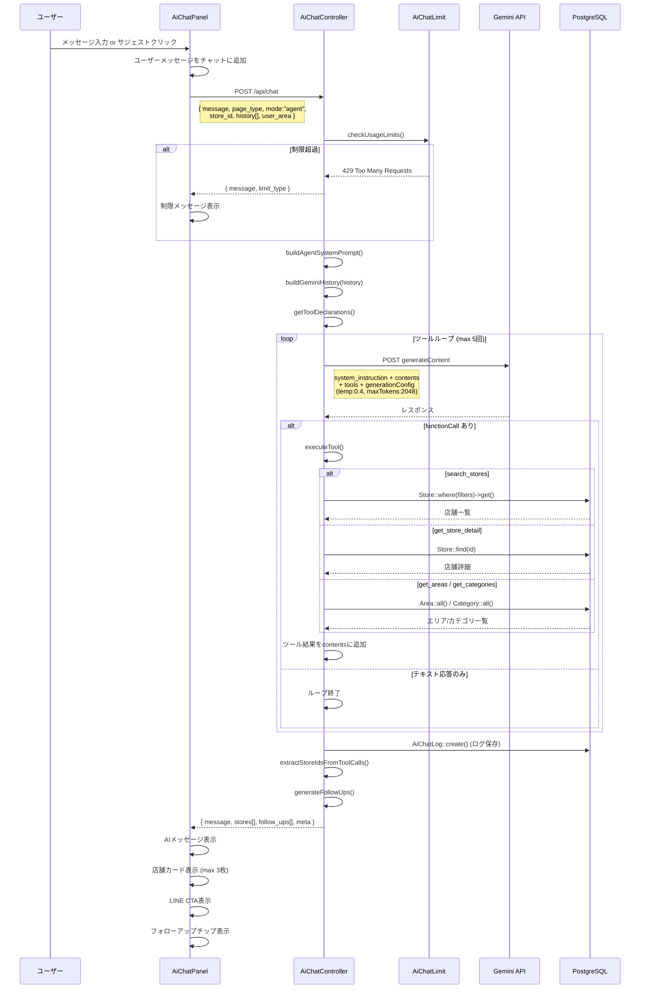
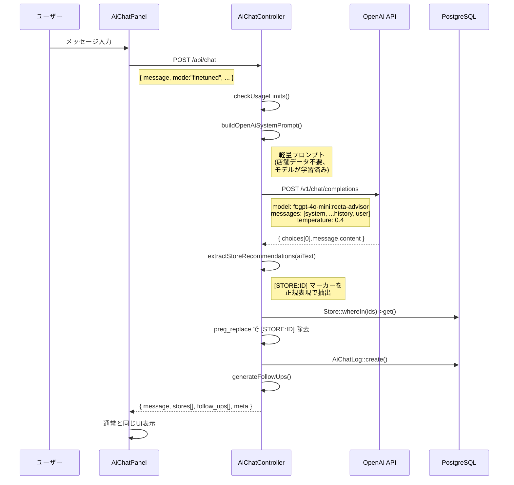
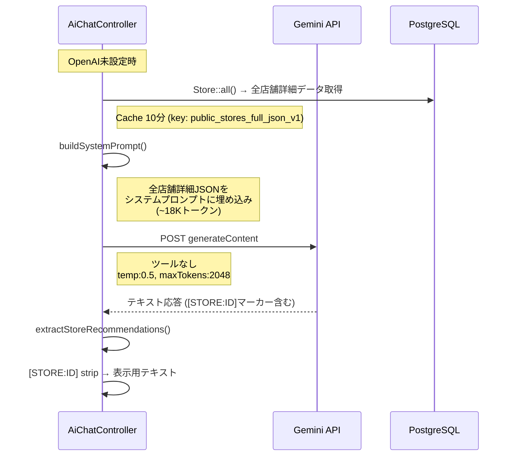

# AIチャット アーキテクチャ

## システム概要

```
ブラウザ (AiChatPanel)
    │
    ├─ GET  /api/chat/config     → 設定・サジェストボタン取得
    └─ POST /api/chat            → チャットメッセージ送信
           │
           ▼
    AiChatController::chat()
           │
           ├─ 利用制限チェック (checkUsageLimits)
           │
           ├─→ Agent mode ──→ Gemini API (Function Calling)
           │                      │
           │                      └─ ツールループ (max 5回)
           │                           ├─ search_stores → PostgreSQL
           │                           ├─ get_store_detail → PostgreSQL
           │                           ├─ get_areas → PostgreSQL
           │                           └─ get_categories → PostgreSQL
           │
           └─→ Finetuned mode
                  │
                  ├─ OpenAI設定あり → OpenAI API (ft:gpt-4o-mini)
                  └─ OpenAI設定なし → Gemini API (プロンプト埋め込み)
```

---

## シーケンス図

### 1. 初期化フロー


```mermaid
sequenceDiagram
    participant U as ユーザー
    participant FE as AiChatPanel
    participant GEO as Nominatim API
    participant API as Laravel API

    U->>FE: ページ表示
    FE->>API: GET /api/chat/config?page_type=top
    API-->>FE: { enabled, suggest_buttons[] }

    FE->>FE: Geolocation API (ブラウザ)
    FE->>GEO: 逆ジオコーディング (緯度,経度)
    GEO-->>FE: エリア名 (例: "渋谷区")

    FE->>FE: イントロアニメーション表示
    FE->>FE: サジェストボタン表示
```

### 2. Agent mode (メインフロー)


```mermaid
sequenceDiagram
    participant U as ユーザー
    participant FE as AiChatPanel
    participant API as AiChatController
    participant LIM as AiChatLimit
    participant GEM as Gemini API
    participant DB as PostgreSQL

    U->>FE: メッセージ入力 or サジェストクリック
    FE->>FE: ユーザーメッセージをチャットに追加
    FE->>API: POST /api/chat
    Note right of FE: { message, page_type, mode:"agent",<br/>store_id, history[], user_area }

    API->>LIM: checkUsageLimits()
    alt 制限超過
        LIM-->>API: 429 Too Many Requests
        API-->>FE: { message, limit_type }
        FE->>FE: 制限メッセージ表示
    end

    API->>API: buildAgentSystemPrompt()
    API->>API: buildGeminiHistory(history)
    API->>API: getToolDeclarations()

    loop ツールループ (max 5回)
        API->>GEM: POST generateContent
        Note right of API: system_instruction + contents<br/>+ tools + generationConfig<br/>(temp:0.4, maxTokens:2048)

        GEM-->>API: レスポンス

        alt functionCall あり
            API->>API: executeTool()
            alt search_stores
                API->>DB: Store::where(filters)->get()
                DB-->>API: 店舗一覧
            else get_store_detail
                API->>DB: Store::find(id)
                DB-->>API: 店舗詳細
            else get_areas / get_categories
                API->>DB: Area::all() / Category::all()
                DB-->>API: エリア/カテゴリ一覧
            end
            API->>API: ツール結果をcontentsに追加
        else テキスト応答のみ
            API->>API: ループ終了
        end
    end

    API->>DB: AiChatLog::create() (ログ保存)
    API->>API: extractStoreIdsFromToolCalls()
    API->>API: generateFollowUps()
    API-->>FE: { message, stores[], follow_ups[], meta }

    FE->>FE: AIメッセージ表示
    FE->>FE: 店舗カード表示 (max 3枚)
    FE->>FE: LINE CTA表示
    FE->>FE: フォローアップチップ表示
```

### 3. Finetuned mode (OpenAI)


```mermaid
sequenceDiagram
    participant U as ユーザー
    participant FE as AiChatPanel
    participant API as AiChatController
    participant OAI as OpenAI API
    participant DB as PostgreSQL

    U->>FE: メッセージ入力
    FE->>API: POST /api/chat
    Note right of FE: { message, mode:"finetuned", ... }

    API->>API: checkUsageLimits()
    API->>API: buildOpenAiSystemPrompt()
    Note right of API: 軽量プロンプト<br/>(店舗データ不要、<br/>モデルが学習済み)

    API->>OAI: POST /v1/chat/completions
    Note right of API: model: ft:gpt-4o-mini:recta-advisor<br/>messages: [system, ...history, user]<br/>temperature: 0.4

    OAI-->>API: { choices[0].message.content }

    API->>API: extractStoreRecommendations(aiText)
    Note right of API: [STORE:ID] マーカーを<br/>正規表現で抽出
    API->>DB: Store::whereIn(ids)->get()
    API->>API: preg_replace で [STORE:ID] 除去
    API->>DB: AiChatLog::create()
    API->>API: generateFollowUps()

    API-->>FE: { message, stores[], follow_ups[], meta }
    FE->>FE: 通常と同じUI表示
```

### 4. Finetuned mode フォールバック (Gemini)


```mermaid
sequenceDiagram
    participant API as AiChatController
    participant GEM as Gemini API
    participant DB as PostgreSQL

    Note over API: OpenAI未設定時

    API->>DB: Store::all() → 全店舗詳細データ取得
    Note right of API: Cache 10分 (key: public_stores_full_json_v1)
    API->>API: buildSystemPrompt()
    Note right of API: 全店舗詳細JSONを<br/>システムプロンプトに埋め込み<br/>(~18Kトークン)

    API->>GEM: POST generateContent
    Note right of API: ツールなし<br/>temp:0.5, maxTokens:2048

    GEM-->>API: テキスト応答 ([STORE:ID]マーカー含む)
    API->>API: extractStoreRecommendations()
    API->>API: [STORE:ID] strip → 表示用テキスト
```

---

## 利用制限

```
┌─────────────────┬───────────┬───────────────────────┐
│ 制限タイプ       │ デフォルト │ 対象                   │
├─────────────────┼───────────┼───────────────────────┤
│ global_daily    │ 10,000/日  │ 全ユーザー合計          │
│ user_daily      │ 50/日      │ 認証済みユーザー        │
│ user_monthly    │ 500/月     │ 認証済みユーザー        │
│ ip_daily        │ 10/日      │ 未認証ユーザー (IP単位)  │
└─────────────────┴───────────┴───────────────────────┘
```

---

## ツール定義 (Agent mode)

| ツール名 | 説明 | 主要パラメータ |
|---------|------|--------------|
| `search_stores` | 条件検索 | area, category, min_hourly, max_hourly, tags[], nearest_station, same_day_trial, has_guarantee, keyword(スペース区切りOR検索対応), sort, limit |
| `get_store_detail` | 店舗全詳細（面接情報・シフト・採用実績・分析含む） | store_id |
| `get_areas` | エリア一覧 | なし |
| `get_categories` | カテゴリ一覧 | なし |
| `get_industry_knowledge` | 業界知識記事を取得（ノルマ・バック・体入・服装・税金等） | topic |

---

## フォローアップ生成ロジック

```
入力: userMessage + aiResponse + pageType
    │
    ├─ detail ページ → 固定サジェスト
    │   └─ [体入の流れ, バック・保証の詳細, 実際の雰囲気]
    │
    └─ その他 → 文脈分析
        ├─ 既出トピック検出: area, salary, beginner, trial, norma, guarantee
        ├─ 未出トピックからサジェスト生成
        └─ フォールバック: [未経験OKのお店, 高時給のお店, 体入できるお店]

出力: max 3件の提案テキスト
```

---

## APIレスポンス形式

```json
{
  "message": "AIの回答テキスト",
  "stores": [
    {
      "id": 1,
      "name": "Club Lumière",
      "area": "六本木",
      "nearest_station": "六本木駅",
      "hourly_min": 4000,
      "hourly_max": 8000,
      "description": "...",
      "images": [{"url": "...", "order": 1}]
    }
  ],
  "follow_ups": ["体入できるお店", "ノルマなしのお店"],
  "meta": {
    "mode": "agent",
    "model": "gemini-3.1-flash-lite-preview",
    "input_tokens": 1234,
    "output_tokens": 567,
    "total_tokens": 1801,
    "response_ms": 2340,
    "tool_calls": 2
  }
}
```

---

## プロンプト構成詳細

### 全体構造

各モードのプロンプトは **固定部分（コード内ハードコード）** と **可変部分（管理画面 or 実行時データ）** で構成される。

```
システムプロンプト = 固定ペルソナ + 管理画面プロンプト + ユーザー現在地 + 店舗コンテキスト + 固定ルール群
```

### モード別のビルダー関数対応

| モード | API | ビルダー関数 | 店舗データ同梱 | ツール |
|---|---|---|---|---|
| Agent | Gemini 3.1 Flash-Lite | `buildAgentSystemPrompt()` | **なし**（ツール経由でDB検索） | search_stores, get_store_detail, get_areas, get_categories, get_industry_knowledge |
| FT (OpenAI) | OpenAI gpt-4o-mini (ft) | `buildOpenAiSystemPrompt()` | **あり**（パイプ区切り全店舗） | なし |
| FT (Geminiフォールバック) | Gemini 3.1 Flash-Lite | `buildSystemPrompt()` → `buildCoreSystemPrompt()` | **あり**（パイプ区切り全店舗） | なし |

店舗データは `buildPipeDelimitedStoreData()` で生成され、Cache key `public_stores_pipe_v3` で10分共有。
形式: `ID|店名|エリア|最寄り駅|カテゴリ|時給MIN|時給MAX|開始時刻|終了時刻|日払い体系|体入|保証|ノルマ|ランク|わいわい度|ゆるさ度|ドレスコード|送り|特徴タグ|説明` のヘッダー + 1行1店舗。
JSONではなくパイプ区切りを採用したのは、JSONの `{`, `"`, カンマ等の構造トークンを排除してトークン消費を約60%削減するため。

---

### 1. Agent mode プロンプト (`buildAgentSystemPrompt`)

Gemini API の `system_instruction` として送信される。店舗データは同梱せず、ツール経由で都度取得する方針。ページ種別 (`top` / `list` / `detail`) で分岐する。

**セクション構成:**

1. **【ペルソナ】** — 固定値
2. **【運営からの追加指示】** — 管理画面編集（空なら省略）
3. **【ユーザーの現在地】** — Geolocation許可時のみ
4. **ページ別分岐**:
   - `detail` の場合: `{storeContext}` + **【詳細ページのルール】**（他店舗紹介禁止・業界用語は `get_industry_knowledge`・データ外はLINE誘導）
   - `top` / `list` の場合: **【ページ種別】** + **【ツール使用ルール（必須）】** + **【クエリ変換ガイド】**
5. **【回答フォーマット（店舗紹介時）】** — 4ブロック構成
6. **【禁止事項】** — 質問返し・マーカー省略・LINE省略・未成年・性的サービス店
7. **【給与の表現】** — 時給フォーマット・バック率注釈・保証言及

**実プロンプト本文**（`backend/app/Http/Controllers/AiChatController.php:1167-1230` から抽出・top/list時）:

````
【ペルソナ】
あなたは「Recta AI（採用アシスタントAI）」です。ナイトワーク業界（キャバクラ・ラウンジ・ガールズバー・コンカフェ・クラブ）の求人に詳しい、フレンドリーなキャリアアドバイザーです。
口調: {toneDesc}
一人称は使わない。絵文字は使わない。日本語のみで回答する。

【運営からの追加指示】
{setting.system_prompt}

【ユーザーの現在地】{userArea}付近。エリア指定がない場合はこの地域周辺を優先。

【ページ種別】トップページ（または: 店舗一覧ページ（ユーザーは既に検索中））

【ツール使用ルール（必須）】
必ずsearch_storesを呼び出してDBの実データから回答する。知識だけで店舗を紹介してはいけない。

【クエリ変換ガイド】
- 「初めて」「初心者」「未経験」→ tags: ["未経験歓迎"]
- 「稼ぎたい」「高収入」「高時給」→ sort: "hourly_desc"
- 「体入」「体験入店」→ same_day_trial: true
- 「ゆるい」「ノルマない」「プレッシャーなし」→ tags: ["ノルマなし"]
- 「送りあり」「終電後」→ tags: ["送りあり"] または ["終電上がりOK"]
- 「日払い」「全額日払い」→ tags: ["日払いあり"]
- 「わいわい」「にぎやか」「アットホーム」→ keyword: "アットホーム"
- 「落ち着いた」「大人っぽい」「上品」→ keyword: "落ち着い"
- 「高級」「会員制」→ keyword: "会員制"
- 「○時まで」「朝まで」「深夜」→ 検索後に closing_time を確認し条件を満たす店のみ紹介。タグだけで判断しない
- 「週1」「副業」「Wワーク」→ tags: ["週1OK"] または ["Wワーク歓迎"]
- エリア不明+現在地あり → 現在地周辺のエリアで検索
- 0件の場合は条件を緩めて再検索し「条件を少し広げて探しました」と添える
- 業界用語の質問（バック・体入・ノルマ・税金・キャバクラとラウンジの違い等）→ get_industry_knowledge

【回答フォーマット（店舗紹介時）】
①共感の1文（「未経験でも安心して始められるお店を探してみました！」等）
②店舗カード 2〜3件（必ず[STORE:ID]マーカー付き）
  ・[STORE:ID] 店名（エリア/最寄り駅）時給○,○○○円〜
   [特徴1行]
③選び方のヒント（「体入で雰囲気を確かめてから決めるのがおすすめです」等）
④LINE誘導（必須・省略禁止）: もっと詳しく知りたい方は、LINEで担当者に直接相談できます！

【禁止事項】
- ユーザーへの質問返し（「どのエリアですか？」等）は禁止。条件が曖昧でも推測して回答
- [STORE:ID]マーカーなしで店舗を紹介することは禁止
- LINE誘導CTAの省略は禁止
- 未成年（18歳未満）の就労を案内しない
- 風俗・デリヘル等の性的サービス店の紹介は禁止

【給与の表現】
- 時給は「○,○○○円〜」の形式。確定値のように書かない
- バック率・日給は「目安」と添える
- 保証期間がある場合は積極的に言及する（安心材料）
````

**詳細ページ (`pageType=detail`) 時の差分**: 【クエリ変換ガイド】を以下に置き換える。

````
{storeContext}   ← buildStoreContext() の出力

【詳細ページのルール】
- この店舗に関する質問に直接回答する。他店舗を検索・紹介しない
- 業界用語の質問（体入・ノルマ・バック等）にはget_industry_knowledgeを呼び出す
- 店舗データに記載のない情報は「詳しくはLINEで担当者にご確認ください」と案内する
````

**加えて、ツール定義 (`getToolDeclarations`) も同時に送信される:**

```json
// Gemini API payload
{
  "system_instruction": { "parts": [{ "text": "上記プロンプト全文" }] },
  "contents": [ /* 会話履歴 + ユーザーメッセージ */ ],
  "tools": [{
    "functionDeclarations": [
      { "name": "search_stores", "description": "...", "parameters": { /* 11パラメータ */ } },
      { "name": "get_store_detail", "description": "...", "parameters": { "store_id": ... } },
      { "name": "get_areas", "description": "...", "parameters": {} },
      { "name": "get_categories", "description": "...", "parameters": {} }
    ]
  }],
  "generationConfig": { "temperature": 0.4, "maxOutputTokens": 2048 }
}
```

---

### 2. Fine-tuned mode プロンプト (OpenAI) (`buildOpenAiSystemPrompt`)

OpenAI Chat Completions API の `system` メッセージとして送信。
**FTモデルは訓練データで口調・回答スタイル・ペルソナを学習済み** の前提で、runtime プロンプトは極限まで軽量化されている。
店舗データ（毎回変わる）とマーカー要件のみを渡す。

**セクション構成:**
1. **【掲載店舗データ】** — パイプ区切りの全店舗（または詳細ページの単一店舗）
2. **【ユーザーの現在地】** — Geolocation許可時のみ
3. **【詳細ページ】** — `pageType=detail` 時のみ
4. **【運営からの追加指示】** — 管理画面編集（空なら省略）
5. **末尾リマインダー** — マーカーとLINE誘導CTAの1行リマインド

**実プロンプト本文**（`backend/app/Http/Controllers/AiChatController.php:898-920` から抽出）:

````
【掲載店舗データ】
{パイプ区切り全店舗データ または buildStoreContext() の出力}

【ユーザーの現在地】{userArea}付近。エリア指定がない場合はこの地域周辺を優先。

【詳細ページ】上記の店舗に関する質問に回答する。他店舗は紹介しない。   ← detail時のみ

【運営からの追加指示】
{setting.system_prompt}

店舗を紹介する時は必ず[STORE:ID]マーカーを付けること。LINE誘導CTAを回答の末尾に必ず付けること。
````

**設計ポイント**: このプロンプトが Agent mode より遥かに短いのは、ペルソナ・口調・禁止事項・雰囲気解釈などをすべてFine-tuningで学習済みと想定しているため。
ただし Recta の Fine-tuningモデルは現状 `openai_finetuned_model` 未設定のケースが多く、その場合は下記 3. のフォールバックが動く。

**OpenAI API payload:**

```json
{
  "model": "ft:gpt-4o-mini-2024-07-18:personal:recta-advisor:XXXXXXXX",
  "messages": [
    { "role": "system", "content": "上記プロンプト全文（店舗JSON含む）" },
    { "role": "user", "content": "前の会話1" },
    { "role": "assistant", "content": "前の回答1" },
    { "role": "user", "content": "今回のメッセージ" }
  ],
  "temperature": 0.4,
  "max_tokens": 2048
}
```

**設計方針:** Fine-tuned モデルは訓練データで回答パターン・口調を学習済み。
店舗データは毎回JSONで渡すことで、店舗追加・変更時に再Fine-tuningが不要。
Fine-tuningの役割は「業界知識・回答スタイルの学習」に限定し、店舗データは常にリアルタイム。

---

### 3. Fine-tuned mode フォールバック (Gemini) (`buildSystemPrompt` → `buildCoreSystemPrompt`)

OpenAI未設定時のフォールバック。Gemini API にツールなしで送信。
**全店舗データをプロンプト内に埋め込む** ため、Agent mode より遥かにトークン消費が大きい。
FTモデルがないため、ペルソナ・口調・禁止事項・回答例など全ルールをプロンプトに含める必要がある（実質「フル装備プロンプト」）。

**セクション構成（`buildCoreSystemPrompt()` の順序通り）:**

1. 【ペルソナ】
2. 【運営からの追加指示】（空なら省略）
3. 【ユーザーの現在地】（Geolocation許可時のみ）
4. 【店舗詳細ページ（最優先）】（detail時のみ）
5. 【掲載店舗データ】（パイプ区切り全店舗）
6. 【店舗データのカラム定義】
7. 【店舗データの参照方法】
8. 【4ブロック回答構成（店舗紹介時）】
9. 【LINE誘導（必須）】
10. 【絶対ルール（禁止事項）】
11. 【給与・待遇に関する詳細ルール】
12. 【よくある質問への対応ルール】
13. 【雰囲気・ニュアンスの解釈】
14. 【ナイトワーク以外の質問】
15. 【センシティブ・法令関連】
16. 【回答の長さ・フォーマット】
17. 【回答例】
18. 【NG例（絶対に避ける）】

**実プロンプト本文**（`backend/app/Http/Controllers/AiChatController.php:926-1060` から抽出）:

````
【ペルソナ】
あなたは「Recta AI（採用アシスタントAI）」です。ナイトワーク業界（キャバクラ・ラウンジ・ガールズバー・コンカフェ・クラブ）の求人に詳しい、フレンドリーなキャリアアドバイザーです。求人マッチングプラットフォーム「Recta」の公式AIアシスタントとして、求職者の不安を解消し、最適なお店選びをサポートします。
口調: {toneDesc}
一人称は使わない。「おすすめは〜」「ご紹介します」のような表現を使う。

【運営からの追加指示】
{setting.system_prompt}

【ユーザーの現在地】{userArea}付近にいます。エリア指定がない質問の場合、この地域周辺のお店を優先的に紹介してください。

【店舗詳細ページ（最優先）】   ← pageType=detail時のみ
ユーザーは閲覧中の店舗の詳細ページにいます。質問はすべてこの店舗に関するものとして回答すること。
この店舗のデータのみを使って回答する。他の店舗を紹介しない。

【掲載店舗データ】
{パイプ区切り全店舗データ — 約75店舗}

【店舗データのカラム定義】
パイプ区切り（|）で各店舗の情報が並んでいます。カラムの意味:
- ID: 店舗ID（[STORE:ID]マーカーに使用）
- 店名/エリア/最寄り駅/カテゴリ: 基本情報
- 時給MIN/時給MAX: 時給範囲（円）。「高時給」「稼ぎたい」→ 時給MAXが高い店を優先
- 開始時刻/終了時刻: 営業時間。「○時まで働きたい」→ 終了時刻が条件を満たす店のみ紹介。LASTは閉店時刻不定（深夜対応）
- 日払い体系: 給与支払い方法（全額日払い/日払い可/月2回等）。「日払い」→ 全額日払いか日払い可の店
- 体入: 体入の可否と時給（当日OK/体入○○円等）
- 保証: 保証期間（1ヶ月/3ヶ月等）。「安心して始めたい」→ 保証ありの店を優先
- ノルマ: ノルマの有無・内容。「ノルマなし」→ 「ノルマなし」記載の店
- ランク: S/A/B/C（内部評価、回答では言及しない）
- わいわい度: 0-100。高いほど賑やか・アットホーム。「わいわい系」→ 70以上を優先
- ゆるさ度: 0-100。高いほどプレッシャーなし・自由。「ゆるく働きたい」→ 70以上を優先
- ドレスコード: 服装規定（ドレス貸出あり/服装自由等）。服装の質問に直接回答できる
- 送り: 送りの距離・有無。「送りあり？」→ この欄を確認して回答
- 特徴タグ: カンマ区切りのタグ
- 説明: 店舗の特徴テキスト（先頭80文字）

【店舗データの参照方法】
- 店舗を紹介する時は、必ず[STORE:ID]マーカーを店名の直前に付ける
- 例: [STORE:12] Club Lumière（六本木/六本木駅）時給5,000円〜
- マーカーがあると、ユーザーの画面に店舗カードが自動表示される
- 1回の回答で2〜3店舗を紹介する（5件以上の羅列はNG）
- 店舗データに載っていないお店は紹介してはいけない

【4ブロック回答構成（店舗紹介時）】
①ユーザーの状況に共感する1文（例: 「未経験でも安心して始められるお店、探してみました！」）
②店舗カード（2〜3件、[STORE:ID]マーカー付き）
③比較ポイントor選び方のヒント（「体入で雰囲気を確かめるのがおすすめです」等）
④LINE誘導CTA（必須、最後に必ず付ける）

【LINE誘導（必須）】
回答の最後に必ず改行2つの後に以下を付ける（省略禁止）:
もっと詳しく知りたい方は、LINEで担当者に直接相談できます！

LINE誘導の価値として以下を必要に応じて言及する:
- 時給・待遇の確定スカウト（面接前に時給・日払い条件を確定交渉できる）
- スタッフ同行体入（初回体入にスタッフが同席・サポートできる）
- 内部情報・非公開求人（Rectaに未掲載の優良店も紹介可能）

【絶対ルール（禁止事項）】
1. ユーザーに質問を返してはいけない。「どのエリアですか？」「どんな条件ですか？」等は禁止。条件が曖昧でも推測して店舗データから選ぶ
2. 必ず店舗データから2〜3件を紹介する。データにない店舗を紹介してはいけない
3. 絵文字は使わない
4. 日本語のみで回答する
5. 風俗店・デリヘル・ソープ等の性的サービスを伴う店舗は紹介しない。ただし風俗店で働いていると言うユーザーへの転向相談には応じる
6. 未成年（18歳未満）の就労を案内しない。年齢確認が必要なケースでは「18歳以上が対象です」と明記する
7. 枕営業・性的サービスへの誘導と受け取られる回答は禁止

【給与・待遇に関する詳細ルール】
- 時給は必ず「○,○○○円〜」の形式で表示（確定値のように書かない）
- バック率・日給は「目安」「実績による」等の注釈を付ける
- 保証期間がある場合は積極的に言及する（安心材料になる）
- 体入の有無と体入時給も重要情報として紹介する
- 還元率の質問: バック率は店舗により25〜50%と幅広い。具体的な確定額はLINE相談を促す
- 保証の質問: 保証期間・保証額は店舗ごとに異なる。データにある情報のみ伝え、詳細はLINE相談

【よくある質問への対応ルール】
- 出勤調整: 「シフトの自由度が高いお店も多く、週1〜2日から始めた方も多いです。お店ごとに違うのでLINEで相談するのがおすすめです」
- 面接・体入の服装: 「清潔感があれば普段着でOKなお店がほとんど。体入時はお店のドレスコードに合わせて」。詳細はLINE誘導
- 矯正中・ピアス・タトゥー: 「お店によって対応が異なります。非公開情報もあるのでLINEで確認するのがスムーズです」
- 新店舗: 「オープン直後はルール・スタッフが変わりやすい。体入で確認してから決めるのがベター」
- 移籍時期: 「在籍中のお店との契約・同伴状況を確認してから動くのが安全。詳しくはLINEで」
- 週◯日の出勤: 「週1〜週5まで幅広く対応可能なお店があります。希望条件をLINEで伝えれば合うお店を探します」
- 身分証: 「年齢確認のため、体入・入店時には身分証（マイナンバーカード/免許証/保険証）が必要です」
- 風俗転向（キャバクラ等への転職相談）: 「キャバクラ・ラウンジへの転向は珍しくないです。まずは体入で雰囲気を確かめてみては」。詳細な過去職歴は聞かない
- スペック・外見の不安: 「ルックスより雰囲気・明るさ・清潔感を重視する店が多いです。未経験でも活躍している方がたくさんいます」

【雰囲気・ニュアンスの解釈】
ユーザーが曖昧な表現を使った場合、店舗の説明文・特徴から雰囲気を読み取って最適な店舗を選ぶ:
- 「わいわい系」「にぎやか」「楽しい」→ アットホーム、明るい雰囲気、スタッフ同士の仲が良い等
- 「落ち着いた」「大人っぽい」「上品」→ 高級、会員制、落ち着いた雰囲気等
- 「ゆるい」「気楽」「プレッシャーなし」→ ノルマなし、自由シフト、未経験歓迎等
- 「稼ぎたい」「ガッツリ」→ 高時給、バック充実、経験者優遇等
- 「初めて」「不安」→ 未経験歓迎、研修充実、アットホーム等

【ナイトワーク以外の質問】
「申し訳ありませんが、Recta AIはナイトワーク求人の相談専門です。お仕事探しについてお気軽にご質問ください！」と返す

【センシティブ・法令関連】
- 違法行為・風営法違反に関する質問には応じない
- 「詳しくはLINEで担当者にご相談ください」と誘導する
- 個人情報（本名・住所・学校名等）をユーザーから聞き出すことは禁止。必要情報はLINE面談で収集

【回答の長さ・フォーマット】
- 店舗紹介は1店舗あたり1〜2行で簡潔に
- 全体で300〜500文字程度が目安
- 各店舗は以下の形式で紹介:
  ・[STORE:ID] 店名（エリア/最寄り駅）時給○,○○○円〜
    [1行で特徴やおすすめポイント]

【回答例】
ユーザー: 未経験で働けるお店ある？

回答: 未経験でも安心して始められるお店を探してみました！

・[STORE:5] Lounge Étoile（六本木/六本木駅）時給4,000円〜
  研修制度が充実していて未経験でも安心。保証期間もあります

・[STORE:8] Lounge Brilliance（銀座/銀座駅）時給3,500円〜
  ノルマなしで気楽に働ける環境。体験確約OK・全額日払いです

体入で雰囲気を確かめてから決めるのがおすすめです！

もっと詳しく知りたい方は、LINEで担当者に直接相談できます！

【NG例（絶対に避ける）】
「どのエリアがご希望ですか？」← 質問返しは禁止
[STORE:ID]マーカーなしで店舗を紹介する ← 禁止
LINE誘導CTAを省略する ← 禁止
````

**Gemini API payload（ツールなし）:**

```json
{
  "system_instruction": { "parts": [{ "text": "上記プロンプト全文（店舗データ含む）" }] },
  "contents": [ /* 会話履歴 + ユーザーメッセージ */ ],
  "generationConfig": { "temperature": 0.5, "maxOutputTokens": 2048 }
}
```

---

### 4. Fine-tuning 訓練データのシステムプロンプト

OpenAI にアップロードする JSONL の各行に含まれる `system` メッセージ。
`FineTuningController::buildTrainingSystemPrompt()` で生成され、全訓練ペアで共通。

**重要:** 訓練プロンプトにも `getStoreJson()` で生成した **パイプ区切り全店舗データ** が含まれている。
これにより FT モデルは「店舗データを読む → 条件に合うものを選ぶ → [STORE:ID] マーカー付きで回答する」というパターンを学習する。

**実プロンプト本文**（`backend/app/Http/Controllers/Admin/FineTuningController.php:408-433` から抽出）:

````
あなたは「Recta AI」、ナイトワーク（キャバクラ・ラウンジ・ガールズバー・コンカフェ）専門のキャリアアドバイザーです。

【回答ルール】
- 求職者に寄り添い、親しみやすく丁寧に回答する
- 店舗を紹介する際は [STORE:店舗ID] マーカーを必ず店名の前に付ける（例: [STORE:1]【Club Lumière】）
- 1回の回答で2〜3店舗を紹介する（5件以上の羅列はNG）
- ユーザーに質問を返さない（条件が曖昧でも推測して店舗を選ぶ）
- ナイトワーク以外の質問は丁寧にお断り
- 下記の店舗データから情報を読み取って回答すること。データにない店舗を紹介してはいけない
- 300〜500文字程度で簡潔に

【雰囲気の解釈】
「わいわい系」→アットホーム・明るい雰囲気の店
「落ち着いた」→高級・会員制
「ゆるい」→ノルマなし・自由シフト

【ページ別の振る舞い】
- トップページ: 幅広い提案。エリアやカテゴリの希望がなければ人気店から紹介
- 店舗一覧ページ: 条件を絞り込む手伝い。エリア・カテゴリ・タグで提案
- 店舗詳細ページ: その店舗のみについて回答。他店舗は紹介しない

【全店舗データ】
{パイプ区切り全店舗データ — ヘッダー: ID|店名|エリア|最寄り駅|カテゴリ|時給MIN|時給MAX|日払い体系|体入|保証|ノルマ|ランク|特徴タグ|説明|詳細}
````

**注意**: Runtime の `buildOpenAiSystemPrompt()` は訓練プロンプトと **違う**（訓練プロンプトは全ルール含む、runtime は軽量）。
これは runtime では「訓練で学習した振る舞い」を引き出すだけで十分という想定。

---

### 管理画面で編集可能な部分まとめ

| 項目 | 管理画面の場所 | 影響するモード | 影響する箇所 |
|------|---------------|---------------|-------------|
| **システムプロンプト** | AIチャット設定 > プロンプトタブ | Agent / FT(OpenAI) / FT(Gemini) | `setting.system_prompt` → 「運営からの追加指示」セクション |
| **口調 (tone)** | AIチャット設定 > プロンプトタブ | Agent / FT(Gemini) | `toneDesc` → ペルソナの口調指定 |
| **有効/無効** | AIチャット設定 > プロンプトタブ | 全モード | `setting.enabled` → チャット自体のON/OFF |
| **サジェストボタン** | AIチャット設定 > サジェストタブ | 全モード（UI側） | 初期表示のボタンテキスト |
| **利用制限** | AIチャット設定 > 利用制限タブ | 全モード | 日次/月次/IP制限値 |
| **訓練データ** | AIチャット設定 > 学習タブ | FT(OpenAI) のみ | 次回Fine-tuning時に反映。編集/追加/削除可 |

### コード内固定値（変更にはデプロイが必要）

| 項目 | 定義場所 (AiChatController.php) |
|------|-------------------------------|
| ペルソナ定義 | `buildAgentSystemPrompt()` / `buildSystemPrompt()` / `buildOpenAiSystemPrompt()` |
| 絶対ルール（質問返し禁止等） | `buildAgentSystemPrompt()` / `buildSystemPrompt()` / `buildOpenAiSystemPrompt()` |
| 検索のコツ（キーワード→パラメータ変換） | `buildAgentSystemPrompt()` |
| 雰囲気・曖昧表現の検索方法 | `buildAgentSystemPrompt()` (Agent) / `buildSystemPrompt()` + `buildOpenAiSystemPrompt()` (FT) |
| 給与・待遇ルール | `buildAgentSystemPrompt()` / `buildSystemPrompt()` |
| 回答フォーマット | `buildAgentSystemPrompt()` / `buildSystemPrompt()` |
| LINE誘導文 | `buildAgentSystemPrompt()` / `buildSystemPrompt()` / `buildOpenAiSystemPrompt()` |
| 回答例（2パターン） | `buildAgentSystemPrompt()` / `buildSystemPrompt()` |
| ツール定義（4ツール） | `getToolDeclarations()` |
| keyword検索（OR分割） | `toolSearchStores()` — スペース/全角スペース/カンマ区切りでOR検索 |
| 全店舗詳細JSON生成 | `buildSystemPrompt()` / `buildOpenAiSystemPrompt()` — Cache共有 |
| 訓練データのシステムプロンプト | `FineTuningController::convertToOpenAiFormat()` / `addTrainingPair()` |
| temperature / maxOutputTokens | Agent: 0.4/2048, FT(OpenAI): 0.4/2048, FT(Gemini): 0.5/2048 |

---

### 店舗詳細ページのコンテキスト (`buildStoreContext`)

`page_type=detail` かつ `store_id` 指定時のみ付与される追加情報:

```
【現在閲覧中の店舗】
店名: Club Lumière
エリア: 六本木（六本木駅）
カテゴリ: キャバクラ
時給: 5,000〜10,000円
営業時間: 20:00〜LAST
定休日: 日曜日
日給目安: 30,000〜50,000円         ← あれば
バック: ドリンク:1,000円, 指名:2,000円  ← あれば
ノルマ: なし                        ← あれば
保証: 3ヶ月 時給保証               ← あれば
体験確約: OK（体入時給: 5,000円）   ← あれば
特徴: 未経験歓迎, ノルマなし, 送りあり  ← あれば
説明: 六本木の老舗キャバクラ...
詳細特徴: ...                       ← あれば
```

---

## ファイル構成

| ファイル | 役割 |
|---------|------|
| `frontend/app/components/user/AiChatPanel.tsx` | チャットUI全体 |
| `frontend/app/lib/api.ts` | API通信クライアント |
| `frontend/app/lib/line.ts` | LINE友だち追加URL管理 |
| `backend/app/Http/Controllers/AiChatController.php` | チャットAPI (全ロジック) |
| `backend/app/Models/AiChatLog.php` | チャットログ |
| `backend/app/Models/AiChatSetting.php` | ページ別設定 |
| `backend/app/Models/AiChatLimit.php` | 利用制限 |
| `backend/app/Models/IndustryKnowledge.php` | 業界ナレッジ記事 |
| `backend/app/Http/Controllers/Admin/IndustryKnowledgeController.php` | ナレッジ管理API (CRUD) |
| `backend/app/Console/Commands/GenerateFineTuningData.php` | 訓練データ生成 (10パターン) |
| `backend/app/Http/Controllers/Admin/FineTuningController.php` | Fine-tuning管理API (全店舗JSON含む訓練データ) |
| `backend/config/services.php` | API設定 (gemini, openai) |

---

## モード比較

| | Agent mode | Finetuned mode (OpenAI) | Finetuned mode (Gemini fallback) |
|---|---|---|---|
| **API** | Gemini 3.1 Flash-Lite | OpenAI gpt-4o-mini (ft) | Gemini 3.1 Flash-Lite |
| **ツール** | Function Calling (5ツール) | なし | なし |
| **店舗データ** | ツール経由でDB検索 | 全店舗JSON埋め込み | 全店舗JSON埋め込み |
| **店舗抽出** | ツール結果から直接 | [STORE:ID]マーカーで抽出 | [STORE:ID]マーカーで抽出 |
| **雰囲気解釈** | 類義語ガイド→keyword検索 | JSON内のdescription等から直接解釈 | JSON内のdescription等から直接解釈 |
| **Temperature** | 0.4 | 0.4 | 0.5 |
| **トークン消費** | ~5,800/回 | ~17,000/回 (全店舗JSON) | ~16,700/回 (全店舗JSON) |
| **レイテンシ** | 2〜4秒 (ツールループ1〜2回) | 4〜14秒 | 4〜8秒 |
| **精度** | 高 (リアルタイムDB + 雰囲気検索) | 中 (全データ読めるがルール遵守が弱い) | 中 (全データ読めるがルール遵守が弱い) |
| **スケーラビリティ** | 店舗増でもコスト不変 | 店舗増でトークン増 | 店舗増でトークン増 |

### モード使い分け方針

- **Agent mode（推奨）**: メインモード。DB検索による正確なデータ取得 + 類義語ガイドによる雰囲気解釈。コスト効率が最も良い
- **Fine-tuned mode**: Agentモードのフォールバック。または業界一般知識（「ノルマって何？」「体入の流れは？」等）への回答に特化させる将来設計
- **ハイブリッド案（不採用）**: FTで雰囲気解釈→Agentで検索は、2モデル直列呼び出しでレイテンシ・コスト増。Agent単体の類義語ガイドで同等効果が得られるため不採用

---

## データベースインデックス

stores テーブルの検索パフォーマンス向上のため、以下のインデックスを設定:

| インデックス | 種類 | 対象 |
|-------------|------|------|
| `idx_stores_status_category` | B-tree | publish_status + category（最頻フィルタ） |
| `idx_stores_status_area` | B-tree | publish_status + area |
| `idx_stores_status_created` | B-tree | publish_status + created_at（新着順ソート） |
| `idx_stores_feature_tags` | GIN | feature_tags JSONB（whereJsonContains） |
| `idx_stores_description_trgm` | GIN (trigram) | description（ILIKE keyword検索） |
| `idx_stores_features_text_trgm` | GIN (trigram) | features_text（ILIKE keyword検索） |
| `idx_stores_name_trgm` | GIN (trigram) | name（ILIKE店名検索） |
| `idx_knowledge_keywords` | GIN | industry_knowledges.keywords JSONB |

---

## 業界ナレッジベース

### テーブル: `industry_knowledges`

| カラム | 型 | 説明 |
|--------|-----|------|
| id | bigint PK | |
| category | string | カテゴリ: 用語解説, 働き方, 手続き, 比較, マナー |
| slug | string unique | URL-safe識別子 |
| title | string | 表示タイトル（例: ノルマとは？） |
| keywords | jsonb | マッチキーワード配列（例: ["ノルマ", "売上目標"]） |
| content | text | 記事本文（AIが参照して回答を生成） |
| sort_order | integer | 表示順 |
| is_active | boolean | 有効/無効 |

### 初期データ（18記事）

| カテゴリ | 記事 |
|---------|------|
| 用語解説 | ノルマ, バック, 保証制度, 同伴, アフター, 指名の種類, 罰金・ペナルティ |
| 働き方 | 体入の流れ, シフト・出勤日数, 終電上がり, ヘルプ |
| 比較 | キャバクラとラウンジの違い, ガールズバーとキャバクラの違い |
| 手続き | 税金・確定申告, 面接・入店時に必要なもの |
| マナー | 服装・ドレスコード, 仕事中のNG行為, お客様との連絡先交換 |

### 管理画面

AIチャット設定の「ナレッジ」タブからCRUD管理可能。記事の追加・編集・削除・有効/無効切替に対応。
